# Voice AI & Webforms – Generic POS Integration Specification

This document defines the API contract for integrating a point-of-sale (POS) or car wash subscription system with voice AI and webforms platforms. It is provider-agnostic: endpoint paths, request/response shapes, and field names are illustrative so implementers can align to their own APIs.

---

## Table of Contents

1. [Document Overview](#document-overview)
2. [Business Context](#business-context)
3. [Integration Approach](#integration-approach)
4. [Data Model and Hierarchy](#data-model-and-hierarchy)
5. [Authentication and Base Configuration](#authentication-and-base-configuration)
6. [Endpoint Grouping Options](#endpoint-grouping-options)
7. [Overview: How the System Uses Your API](#overview-how-the-system-uses-your-api)
8. [Value Summary and Retention Flow](#value-summary-and-retention-flow)
9. [Operational Flows (Priority)](#operational-flows-priority)
10. [API Call Decision Tree](#api-call-decision-tree)
11. [ID Flow Between Endpoints](#id-flow-between-endpoints)
12. [Priority Endpoints (Support First)](#priority-endpoints-support-first)
13. [Additional Endpoints](#additional-endpoints)
14. [Offer Request/Response and Retention Offer Types](#offer-requestresponse-and-retention-offer-types)
15. [Error Handling and Response Codes](#error-handling-and-response-codes)
16. [Request/Response Summary](#requestresponse-summary)
17. [Testing Recommendations](#testing-recommendations)
18. [Implementation Notes](#implementation-notes)
19. [Optional / Future](#optional--future)
20. [Appendix](#appendix)

---

## Document Overview

### Purpose

This specification describes the endpoints, request/response formats, and flows required for a POS or car wash operator to integrate with voice AI (e.g. handling cancellation and retention calls) and/or webforms (e.g. portal-based account and subscription management). The same API contract can support both channels.

### Scope

- **In scope:** Customer/user lookup, account and vehicle data, plan/subscription info, value summary (wash history/savings), retention offers, cancellation, optional pause/resume and vehicle lifecycle.
- **Out of scope:** Payment processing details, point-of-sale hardware, or channel-specific UI copy. Exact wording of prompts is not fixed by the API.

### Conventions

- **Generic terms:** This document uses **User/Customer**, **Account**, **Vehicle**, and **Plan/Subscription/Membership** as canonical terms. Your system may use different names (e.g. member, subscription, membership); map them as needed.
- **Terminology mapping:** Map the terms used in this document to your entities and IDs as appropriate. For example: *plan* ↔ *subscription* ↔ *membership*; *customer_id* ↔ *user_id* ↔ *member_id*; *plan_id* ↔ *subscription_id* ↔ *membership_id*.
- **Paths and fields:** Endpoint paths and request/response field names in this document are **illustrative**. Implementers should align to their existing API structure and naming.

### Data Hierarchy Note

Users may have many Accounts; each Account may have one or more Vehicles; each Vehicle may have one active Plan/Subscription. Identifiers used throughout are generic: `customer_id` (or `user_id`), `account_id`, `vehicle_id`, `plan_id` (or `subscription_id`), and `retention_offer_id`. Use your own stable IDs and map them to these names in the contract.

### Key Terms

- **Value summary:** Wash history and savings data played back to the customer before presenting a retention offer (e.g. "You pay $X/month; you used Y washes; at $Z each you saved $W").
- **Retention offer:** An offer presented to retain the customer (e.g. multi-month discount, one-time discount, free washes). The system may **get** the offer, **present** it, then **apply** it or proceed to cancellation.

---

## Business Context

The primary use case is **cancellation handling**: high cancellation volume creates capacity constraints. The goal is to reduce call and ticket workload by automating lookup, retention offer presentation, and cancellation via API.

Two solution targets are supported by this integration:

1. **Voice AI** – Handles incoming cancellation and retention conversations in real time so fewer cancellation tickets are created.
2. **Ticket / backlog agent** – Works through existing tickets and backlog using the same API to look up customers, retrieve plan info, present or apply retention offers, and cancel plans without manual steps.

Both depend on the POS providing endpoints to identify customers, return plan/membership and vehicle data, return value summary and retention offers, and execute cancellation (and optionally apply retention). This document defines the API contract for that integration.

---

## Integration Approach

The integration assumes the following flow:

1. **Lookup** by a primary identifier (phone for voice, or email for web) returns **customer + plan + vehicle** (or the IDs needed to fetch them).
2. **Disambiguation** when needed: if multiple plans, accounts, or vehicles exist, use alternative lookups (email, license plate) or clarifying questions until a **single plan** is isolated.
3. **Value summary and retention offer** are fetched once the plan is known—either via one **combined** endpoint or **separate** endpoints.
4. If value summary or offer are **missing** (null), the system does not present the retention path and proceeds to cancellation confirmation when the customer confirms.
5. If **both exist**, the system plays the value summary, asks if the customer still wants to cancel; if yes, presents the retention offer; if the customer accepts, it **applies** the offer; if they decline, it confirms and **cancels**.

**Primary identifier:** For voice, the default first lookup is by **phone** (caller number is available). For web, the primary identifier may be **email** or **phone** depending on how the user logs in. Email and license plate are used when phone lookup fails or when disambiguation is needed.

**Endpoint flexibility:** How you group data (e.g. value summary and retention offer in one response, or separate endpoints) is flexible. The logical operations—lookup, get plan info, get value summary, get retention offer, apply retention offer, cancel—must be supported; paths and response shapes can be combined to match your API.

---

## Data Model and Hierarchy

### Entities

| Entity | Description |
| ------ | ----------- |
| **User/Customer** | The person who holds accounts and uses the service. Identified by phone, email, or other identifier. |
| **Account** | A container for vehicles and subscriptions. A user may have multiple accounts (e.g. personal, business). |
| **Vehicle** | A vehicle registered to an account. May have zero or one active plan/subscription. |
| **Plan/Subscription/Membership** | The active subscription or membership tied to a vehicle (or account). Used for billing, value summary, and retention. |
| **Retention offer** | An offer (e.g. discount, free washes) that can be presented and applied to retain the customer. |

### Relationships and Multiplicity

- One **User** has many **Accounts** (or one account in the simple case).
- One **Account** has many **Vehicles** (or one vehicle in the simple case).
- One **Vehicle** has zero or one **active** Plan/Subscription at a time.
- **Retention offers** are scoped to a plan (or subscription); one get-offer call returns at most one offer per plan.

### Active Plan

When a customer has multiple plans or vehicles, the system must **isolate the single plan** to cancel or to use for value/retention. You can support this by:

- **Option A:** Returning a single **active** plan in the payload (e.g. the current one for that customer or vehicle).
- **Option B:** Returning a list with a clear indicator of the active one (e.g. `status: "active"` on the item, or a top-level `active_plan_id` / `current_membership_id` / `primary_account_id`).

At least one **stable identifier for the active plan** is required so the system can pass it to get value summary, get retention offer, apply offer, and cancel.

### Identifier Glossary

| Term in this document | Your system may use |
| --------------------- | ------------------- |
| `customer_id` | `user_id`, `member_id`, `account_id` |
| `account_id` | `account_id`, `org_id` |
| `vehicle_id` | `vehicle_id`, `car_id` |
| `plan_id` | `subscription_id`, `membership_id`, `plan_id` |
| `retention_offer_id` | `offer_id`, `retention_offer_id` |

Use the same identifier in requests and responses so the system can chain calls (e.g. lookup returns `customer_id`; get plan info and cancel use that `customer_id` and the returned `plan_id`).

### Entity-Relationship View

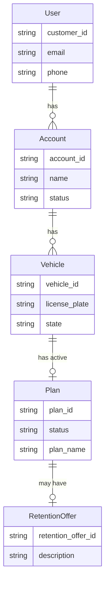

### Subscription State (Optional)

Plans/subscriptions may follow a simple state model:

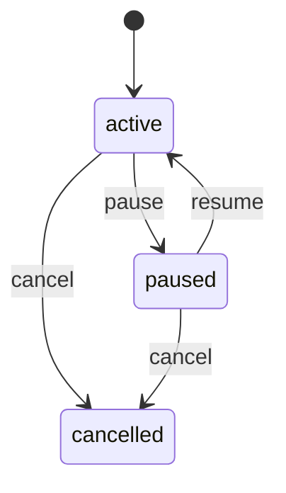

States such as `active`, `paused`, `cancelled`, and `past_due` (if applicable) should be documented in your API so the system can handle them correctly (e.g. only offer retention for active plans).

---

## Authentication and Base Configuration

### Base URL

Use a base URL appropriate to your environment (e.g. `https://api.example.com`). Versioning (e.g. `/api/v1/`) is recommended; document the path prefix your API uses.

### Content-Type

- **Content-Type:** `application/json` for all POST request bodies.

### Authentication Options

Implementers may use one of the following patterns (or both, with different endpoint groups).

#### Option 1: Single-Tenant (API Key + IP)

- **Header:** `Api-Key` (or `Authorization: Bearer <token>` if you prefer).
- **IP whitelisting:** The integrating platform will provide the IP address(es) used to call your API; you may restrict access to those IPs.
- **Use case:** Single partner or single environment; no tenant or user context in headers.

#### Option 2: Multi-Tenant (Tenant + User + Account Headers)

- **Tenant identification:** Every request includes:
  - `X-Tenant`: Unique tenant identifier for the corporate client.
  - `X-Tenant-API-Key`: API key associated with the tenant.
- **User context:** For endpoints that operate on behalf of a specific user (e.g. get accounts, get vehicle data, cancel subscription), include:
  - `X-User-Id`: The user/customer ID obtained from an initial lookup (e.g. lookup by phone or email).
  - `X-Account-Id`: The account to act on. Use a specific `account_id` when the user has multiple accounts; use `USE-DEFAULT-ACCOUNT` when the user has only one account or when the default is acceptable.
- **Establishing user context:** The first call is typically a lookup by phone or email (with tenant headers only). The response includes the user identifier (e.g. `id` or `customer_id`). That value is then sent as `X-User-Id` on subsequent requests.
- **Account selection:** If a user has multiple accounts, the integrating system may call "get accounts by user" and present a selection; the chosen `account_id` is then sent as `X-Account-Id` for later operations.

---

## Endpoint Grouping Options

### First Lookup – Customer + Plan + Vehicle

The first lookup (by phone, email, or license plate) should return **customer** and, when possible, **plan** and **vehicle** information so the system can greet with context and avoid extra round-trips. Options:

- **Single response:** Lookup returns customer, plan(s), and vehicle(s) in one response (with clear active plan or list for disambiguation).
- **Two-step:** Lookup returns only customer (and IDs); a separate "get plan info" (or "get vehicle data") call returns plan and vehicle details.

### Value Summary + Retention Offer

- **Combined:** One endpoint returns both wash history/savings (value summary) and the retention offer. The system calls it once after the plan is isolated.
- **Separate:** Two endpoints—e.g. value-summary and get-retention-offer—each with a single responsibility. The system calls both after the plan is isolated when needed.

Either approach is valid; document which you support so the integrating system can call the correct endpoint(s).

**High-level flow:**

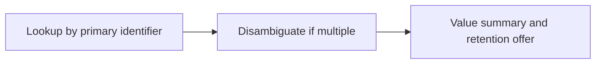

### When to Disambiguate

- Lookup by **phone** or **email** may return **multiple** plans or vehicles. The system will use email, license plate, or clarifying questions to narrow to one plan before fetching value summary and retention offer.
- Lookup by **license plate** (and state) is scoped to one vehicle, so the response can be that vehicle and its active plan, reducing the need for extra questions.

---

## Overview: How the System Uses Your API

The flow is: lookup by primary identifier (e.g. phone) → obtain customer + plan + vehicle → disambiguate if needed → then one combined value-summary + retention-offer call (or separate calls) → play value summary → present offer → apply-offer or cancel.

### Call/Session Start and Greeting

The first step is to get customer and their plan/vehicle. That may be one call (lookup response includes plan and vehicle) or two calls (lookup then get plan info). Value and offer are fetched later when the customer expresses cancel intent.

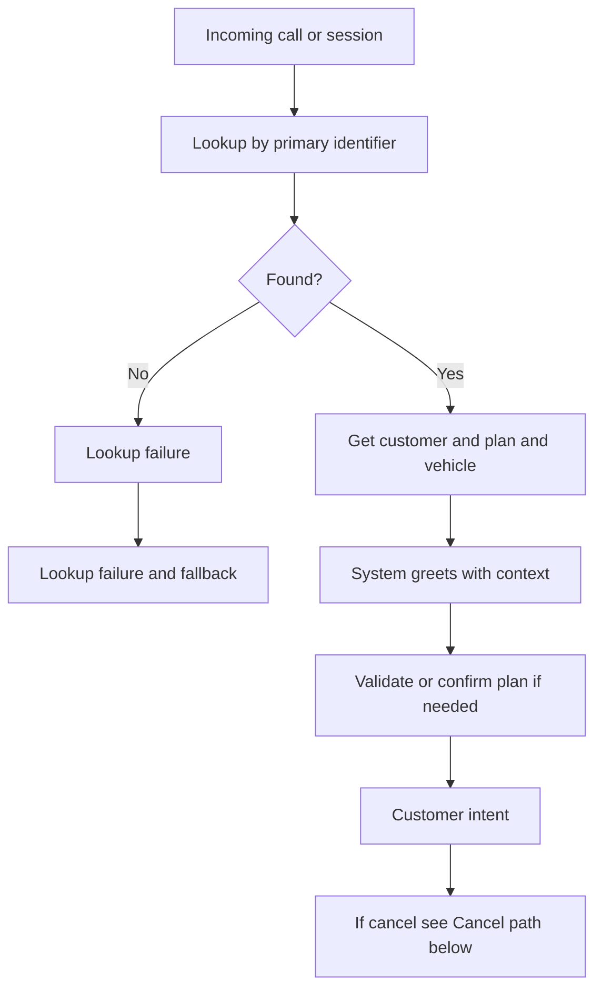

### After Greeting: Cancel Intent and Outcomes

When the customer's intent is to cancel, the flow continues as below. Detailed sequences are in Operational Flows.

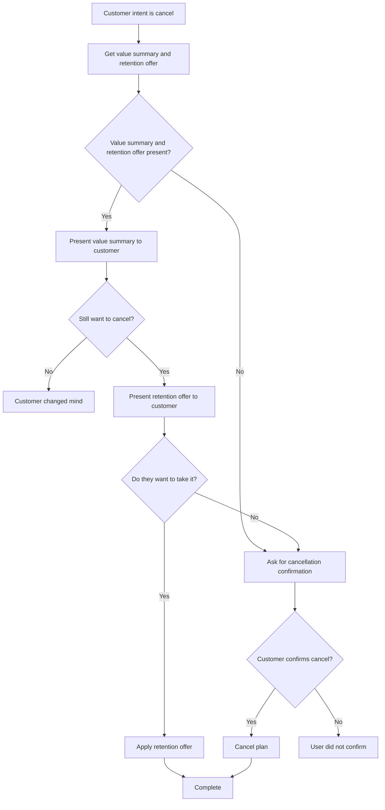

### Lookup Failure and Fallback

When lookup by the primary identifier fails (e.g. no customer for that phone), the system tries email, then license plate, then may ask for an alternative identifier. When phone lookup returns multiple results, email or plate is used to narrow; once the plan is isolated, the system calls the value-summary and retention-offer endpoint(s).

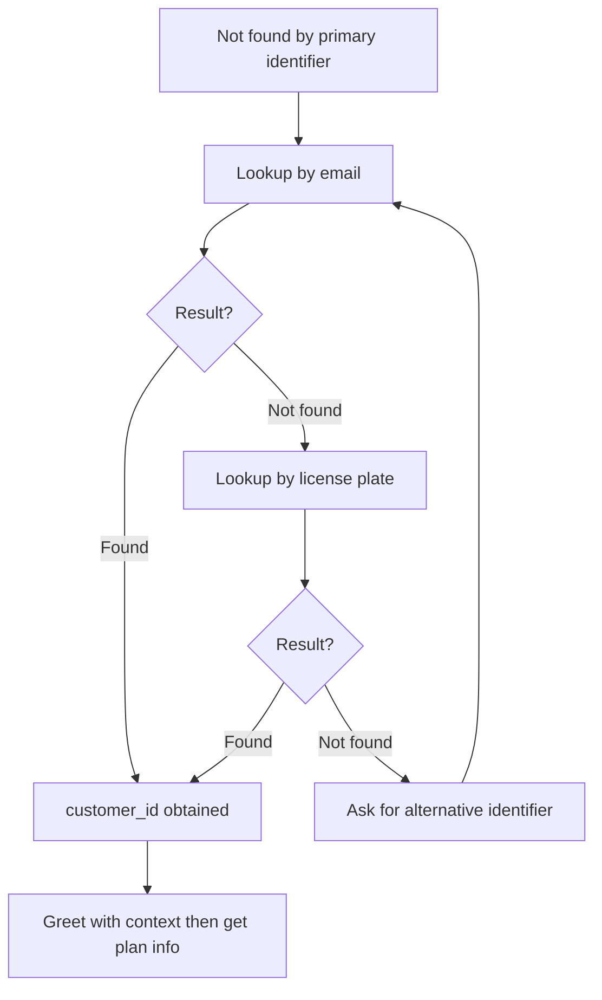

---

## Value Summary and Retention Flow

Before presenting a **retention offer**, the system may play back a **value summary** so the customer sees what they get from their plan. Value summary and retention offer data are used **after** the customer is identified and has stated cancel intent.

**When to call:** After the plan is isolated. If value summary and retention offer are combined in one endpoint, one call returns both; otherwise the system calls value-summary and get-retention-offer separately.

**Voice vs web:** For **voice flows**, value summary is recommended so the AI can speak savings and usage. For **web-only** integrations, value summary may be optional; the system can proceed to offer and cancellation without it.

**Null handling:** If the customer has no value to show (e.g. value gained is less than what they paid), you may return value summary null and/or retention offer null. The system will not play value summary or present an offer and will proceed to cancellation confirmation when the customer confirms.

**Flow order:** Present value summary (when not null) → ask if still want to cancel → if yes, present retention offer → customer accepts (apply-offer) or declines (confirm cancel, then cancel). When both value and offer are null, go straight to cancellation confirmation.

---

## Operational Flows (Priority)

The following sequence diagrams illustrate the main flows. Participant names are generic (Voice AI System, Partner API, Customer). Request/response details for each step are in Priority Endpoints and Additional Endpoints.

### Flow 1: Cancel by Phone

**Diagram 1a – Call start (phone):** Incoming call; system looks up by phone, then greets. If not found, the system follows the lookup failure and fallback flow. Customer and plan/vehicle come from the first step (one lookup response or lookup then get-info). Value summary and retention offer are fetched later.

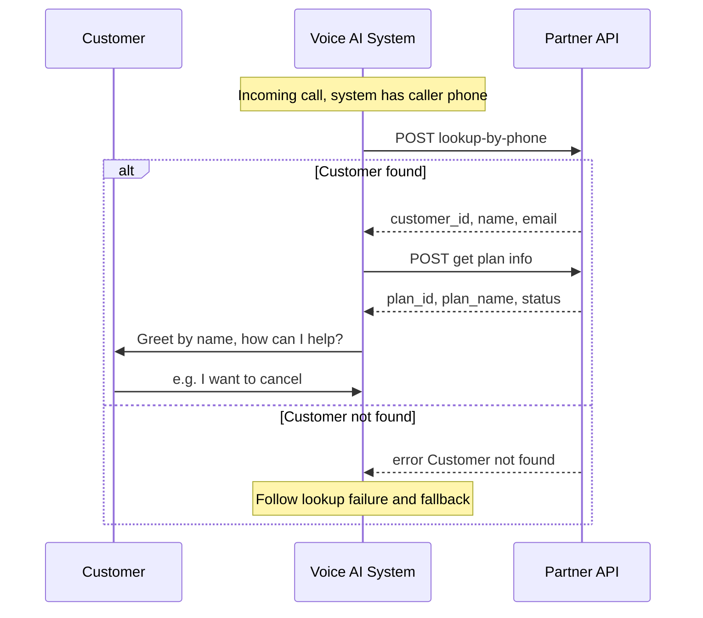

**Diagram 1b – Cancel by phone (after greeting):** Customer said they want to cancel; system confirms plan if needed, then gets value summary and retention offer (one combined call or separate calls). Outcomes are in Diagram 1c.

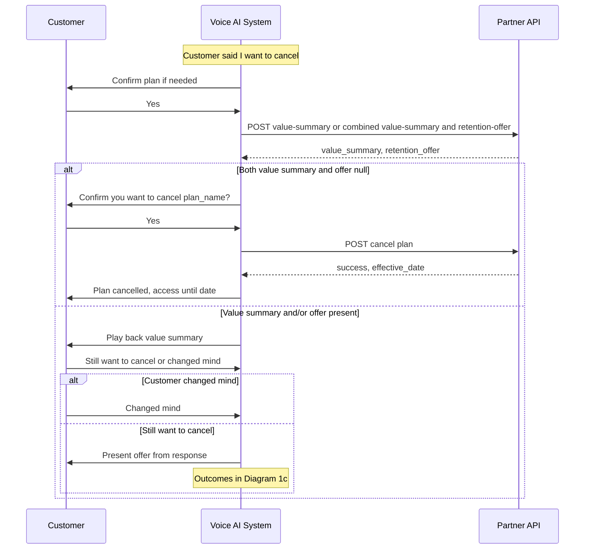

**Diagram 1c – Cancel outcomes:** After value summary and offer (or when none), one of these outcomes.

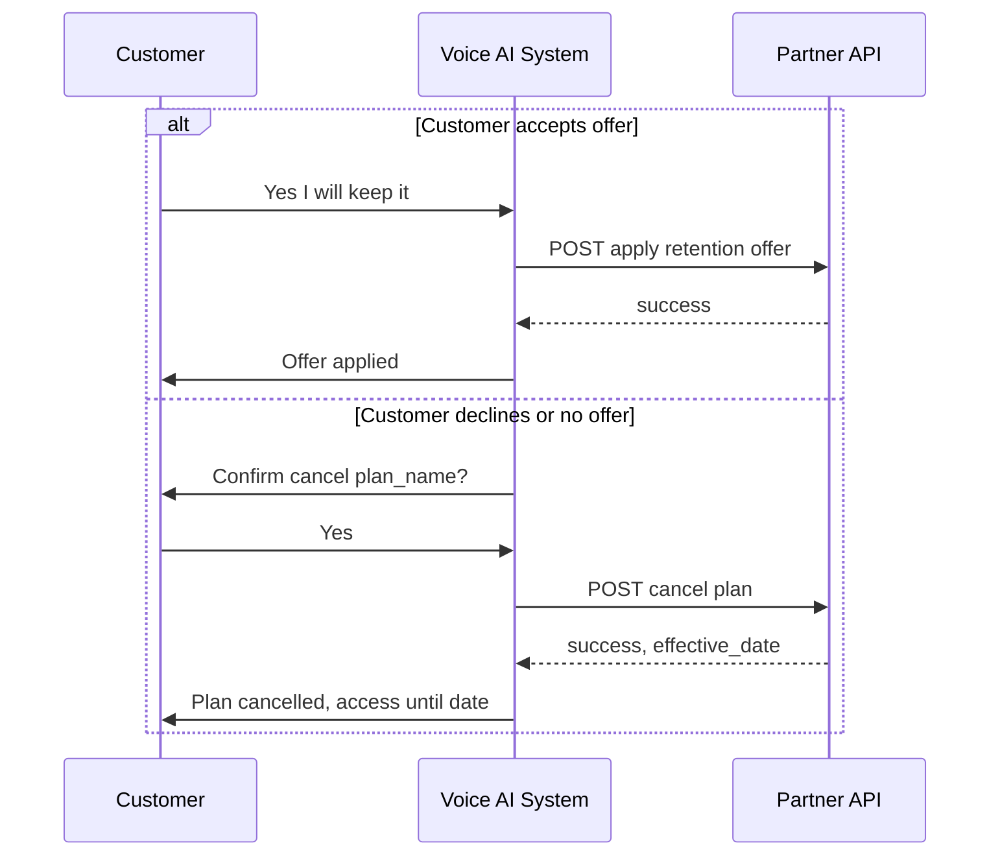

### Flow 2: Cancel by License Plate

When the customer is identified by license plate (e.g. after fallback or "cancel for plate ABC123, CA"). After this diagram, the cancel path and outcomes match Flow 1 (Diagram 1b and 1c).

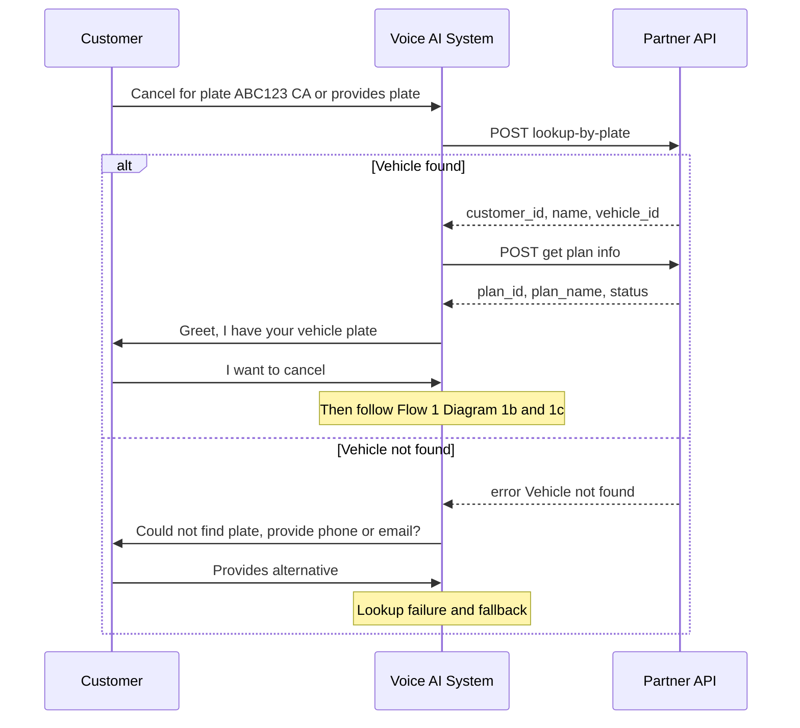

### Flow 3: Retention Offer – Get and Apply

Customer already identified and greeted. Same flow whether the customer asks for offers at the start or during the conversation.

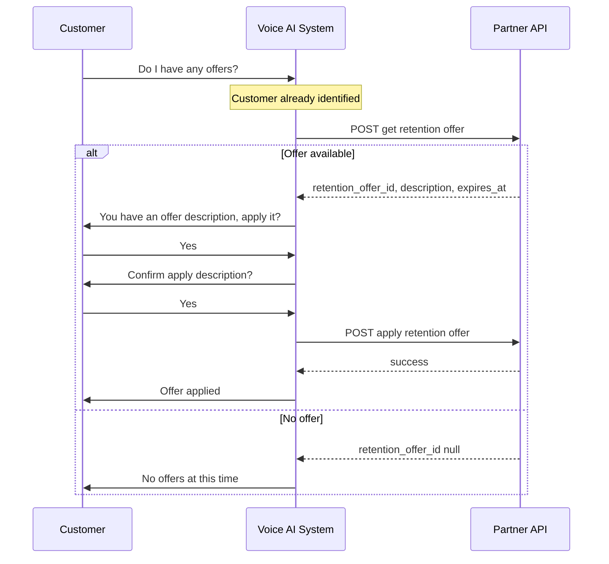

### Flow 4: Lookup by Phone Fails – Identify by Email

When lookup by phone returns not found; customer provides email. After this diagram, use the same cancel path and outcomes as Flow 1 (Diagram 1b and 1c).

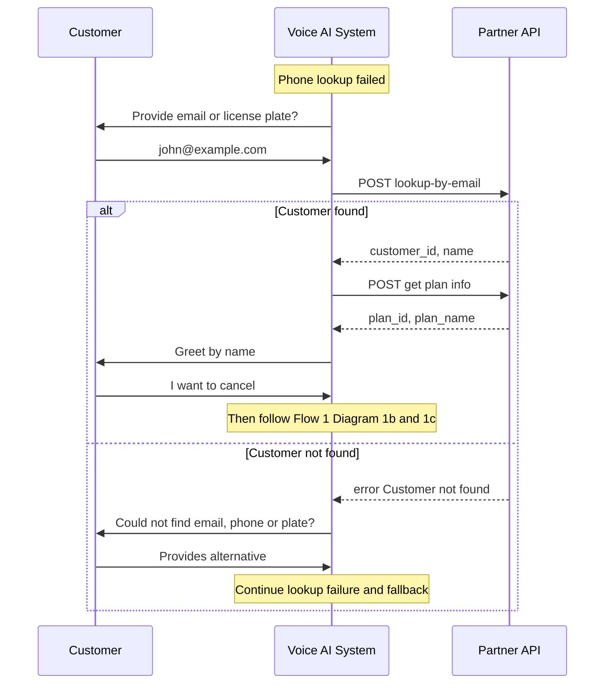

### Flow 5 and 6: Full Cancellation (Reference)

For full step-by-step cancellation by phone, use Flow 1 (Diagrams 1a, 1b, 1c). For cancellation when the customer is identified by license plate, use Flow 2 then Flow 1 Diagrams 1b and 1c.

---

## API Call Decision Tree

Which endpoints are called depends on call/session start (lookup by primary identifier first), then customer intent. Value summary and retention offer are requested after the plan is isolated (one combined call or separate calls).

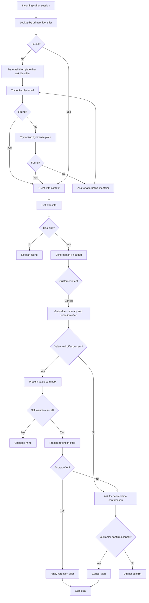

---

## ID Flow Between Endpoints

IDs returned from one endpoint are passed into the next. Below is the minimal set for the multi-call approach. If value summary and retention offer are combined, one call replaces the separate value-summary and get-offer steps.

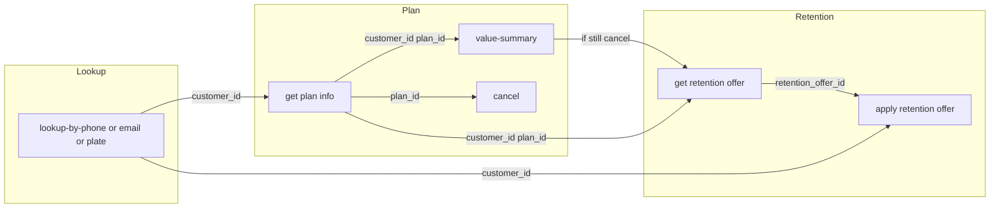

**ID flow table:**

| From | Outputs | Used by |
| ---- | ------- | ------- |
| Lookup (phone/email/plate) | `customer_id`, optionally `plan_id`, `vehicle_id` | Get plan info, get value summary, get retention offer, apply offer, cancel |
| Get plan info | `plan_id`, `customer_id`, plan details | Value summary, get retention offer, apply offer, cancel |
| Get retention offer | `retention_offer_id` | Apply retention offer |
| Apply retention offer | success/failure | — |
| Cancel plan | success, `effective_date` | — |

---

## Priority Endpoints (Support First)

The following eight endpoints support the core flows: identify the customer, get plan/membership info, play value summary when cancelling, get and apply retention offer, and cancel. Paths and field names are **examples**; align to your API.

Each endpoint is specified with: **Purpose**, **Priority**, **Method and path**, **Request** (headers and body), **Response** (success, no result, errors), **Notes**.

---

### 1. Lookup Customer by Phone

**Priority:** Yes

**Purpose:** Identify the customer by phone number. Used at session start when the caller is identified by phone (e.g. voice: ANI). The system calls this before greeting so it can greet by name and with context.

**Endpoint:** `POST /api/customers/lookup-by-phone` (or equivalent path)

**Request headers:** Per [Authentication and Base Configuration](#authentication-and-base-configuration): API key or tenant headers as applicable.

**Request body:**

```json
{
  "phone": "5551234567"
}
```

- `phone` (string, required): Phone number; document expected format (e.g. 10 digits, no country code). Normalize (no +1, spaces, dashes) before lookup.

**Response (200 – found):**

```json
{
  "customer_id": "12345",
  "name": "John Doe",
  "email": "john.doe@example.com",
  "phone_number": "5551234567",
  "status": "active"
}
```

Return a stable identifier for the customer (`customer_id`, `user_id`, `member_id`, etc.). Depending on your model, the response may include multiple plans or vehicles; either return a single active/default or a list with clear identifiers for disambiguation.

**Response (404 – not found):**

```json
{
  "error": "Customer not found",
  "message": "No customer found for this phone number"
}
```

**Notes:** Phone lookup may return multiple results (e.g. multiple accounts/plans); the system will disambiguate with email, plate, or clarifying questions. The `customer_id` (or equivalent) is used in subsequent calls.

---

### 2. Lookup Customer by Email

**Priority:** Yes

**Purpose:** Identify the customer by email when they use email instead of phone (e.g. web portal or fallback after phone lookup fails).

**Endpoint:** `POST /api/customers/lookup-by-email` (or equivalent)

**Request body:**

```json
{
  "email": "john.doe@example.com"
}
```

- `email` (string, required): Email address (case-insensitive).

**Response (200 – found):** Same shape as lookup-by-phone: include customer identifier, name, email, and optionally plans/vehicles. If multiple, provide a single active/default or a clear list.

**Response (404 – not found):** Same pattern as lookup-by-phone.

**Notes:** Email lookup may return multiple plans/vehicles; document whether you return one or many and how the active one is indicated.

---

### 3. Lookup Customer by License Plate

**Priority:** Yes

**Purpose:** Identify the customer when they provide license plate (and optionally state) instead of phone or email. Often scoped to one vehicle and its active plan.

**Endpoint:** `POST /api/customers/lookup-by-plate` (or equivalent)

**Request body:**

```json
{
  "license_plate": "ABC123",
  "state": "CA"
}
```

- `license_plate` (string, required)
- `state` (string, optional): State/province code for disambiguation.

**Response (200 – found):**

```json
{
  "customer_id": "12345",
  "name": "John Doe",
  "vehicle_id": "v789",
  "license_plate": "ABC123",
  "state": "CA"
}
```

Include whatever IDs you need for subsequent calls (e.g. `vehicle_id`, `plan_id`). Because the key is vehicle-scoped, the response is typically one vehicle and its active plan.

**Response (404 – not found):** Same pattern as above.

---

### 4. Get Plan / Membership / Subscription Info

**Priority:** Yes

**Purpose:** Return the customer's current plan (or membership/subscription) so the system can confirm what they have and obtain IDs for cancellation and retention.

**Endpoint:** `POST /api/plans/get-info` (or `/api/membership/get-info`, `/api/subscription/get-info`)

**Request body:**

```json
{
  "customer_id": "12345"
}
```

If your API keys by `account_id` or `vehicle_id`, use that field; the system will send back the identifier returned from lookup.

**Response (200 – has active plan):**

```json
{
  "plan_id": "sub456",
  "customer_id": "12345",
  "status": "active",
  "plan_name": "Unlimited Monthly",
  "start_date": "2025-01-15",
  "next_billing_date": "2026-03-15",
  "auto_renew": true
}
```

Provide at least one stable ID for the plan (`plan_id`, `subscription_id`, `membership_id`) for use in cancel and retention.

**Response (200 – no active plan):**

```json
{
  "plan_id": null,
  "customer_id": "12345",
  "status": "none",
  "message": "No active plan or membership found"
}
```

---

### 5. Get Value Summary (Wash History / Savings)

**Priority:** Yes (for cancellation/retention flow)

**Purpose:** Return structured data so the system can play back to the customer how much value they get from their plan (e.g. plan price, washes used, single-use equivalent, value saved). Required for voice flows; optional for web-only. May be a separate endpoint or combined with retention offer.

**Endpoint:** `POST /api/plans/value-summary` (or combined with retention offer, e.g. `/api/plans/value-and-offer`)

**Request body:**

```json
{
  "customer_id": "12345",
  "plan_id": "sub456"
}
```

**Response (200):**

```json
{
  "customer_id": "12345",
  "plan_id": "sub456",
  "plan_name": "Unlimited Monthly",
  "plan_tier": "unlimited",
  "plan_price": 25.00,
  "plan_price_currency": "USD",
  "period_type": "month",
  "period_start": "2026-02-01",
  "period_end": "2026-02-28",
  "washes_used_in_period": 4,
  "single_use_price_per_wash": 15.00,
  "value_of_washes_at_single_use": 60.00,
  "value_saved_in_period": 35.00
}
```

Field names may follow your model. Minimum needed: what the customer pays, washes used in the period, single-use price per wash, and either `value_saved_in_period` or the components so the system can compute it. If you prefer to return only components, the system can compute value saved.

**Response (200 – no value to show):** Return value summary null or an empty/equivalent structure when the customer has no value gained or value is less than amount paid. The system will skip value playback and proceed to cancellation confirmation or retention offer as applicable.

**Response (404):** E.g. no plan or no usage data; standard error body. The system will skip value playback and continue the flow.

---

### 6. Get Retention Offer

**Priority:** Yes

**Purpose:** Return the retention offer (if any) for the given plan. The response must include a stable offer ID for use in apply-offer (or respond-offer). May be combined with value summary in one endpoint.

**Endpoint:** `POST /api/retention/get-offer` (or equivalent)

**Request body:**

```json
{
  "customer_id": "12345",
  "plan_id": "sub456"
}
```

Include whatever IDs you need (e.g. `account_id`, `subscription_id`).

**Response (200 – offer available):**

```json
{
  "retention_offer_id": "offer789",
  "offer_type": "multi_month",
  "customer_id": "12345",
  "plan_id": "sub456",
  "description": "50% off for 3 months",
  "duration_months": 3,
  "discount_percent": 50,
  "expires_at": "2026-03-01T00:00:00Z",
  "terms": "Valid for 3 months"
}
```

`retention_offer_id` must be unique and usable in the apply (or respond) endpoint. Optional `offer_type` helps the system phrase terms. See [Offer Request/Response and Retention Offer Types](#offer-requestresponse-and-retention-offer-types) for other offer shapes.

**Response (200 – no offer):**

```json
{
  "retention_offer_id": null,
  "customer_id": "12345",
  "message": "No offers available"
}
```

---

### 7. Apply Retention Offer

**Priority:** Yes

**Purpose:** Apply or redeem the retention offer. Called with the offer ID from get-offer (or from a combined value-and-offer response) and the identifiers you require. Alternatively, some implementations use a single "respond to retention offer" endpoint that accepts both accept and decline; see [Additional Endpoints](#additional-endpoints).

**Endpoint:** `POST /api/retention/apply-offer` (or equivalent)

**Request body:**

```json
{
  "retention_offer_id": "offer789",
  "customer_id": "12345",
  "plan_id": "sub456"
}
```

Add any additional IDs your API needs (e.g. `account_id`, `subscription_id`).

**Response (200 – success):**

```json
{
  "success": true,
  "message": "Offer applied successfully",
  "retention_offer_id": "offer789",
  "customer_id": "12345",
  "applied_at": "2026-02-20T14:30:00Z",
  "discount_code": "WASH50-789"
}
```

**Response (400/404 – e.g. expired or invalid):**

```json
{
  "success": false,
  "error": "Offer expired",
  "message": "This offer expired on 2026-03-01"
}
```

---

### 8. Cancel Plan / Apply Cancellation

**Priority:** Yes

**Purpose:** Cancel the customer's plan, membership, or subscription. Naming on your side may be "cancel plan", "apply cancellation", "cancel subscription", etc.

**Endpoint:** `POST /api/plans/cancel` (or `/api/subscription/cancel`, `/api/cancellation/apply`)

**Request body:**

```json
{
  "customer_id": "12345",
  "plan_id": "sub456",
  "cancel_at_period_end": true,
  "cancellation_reason": "Customer requested"
}
```

`plan_id` is the ID returned from get plan info. If you use `subscription_id` or `membership_id`, use that name. Optional: `cancellation_reason` or `cancellation_reason_id` for analytics; see [Appendix](#appendix) for optional reason codes.

**Response (200 – success):**

```json
{
  "success": true,
  "message": "Plan cancelled successfully",
  "plan_id": "sub456",
  "cancellation_date": "2026-02-20",
  "effective_date": "2026-03-15",
  "cancel_at_period_end": true
}
```

**Response (400 – e.g. already cancelled):**

```json
{
  "success": false,
  "error": "Invalid request",
  "message": "Plan is already cancelled"
}
```

---

## Additional Endpoints

These endpoints support richer flows: multi-account selection, vehicle data, pause, respond to offer (accept/decline in one call), and vehicle lifecycle. Each is specified with the same template: Purpose, Priority, Method/path, Request, Response, Notes.

---

### 9. Get Accounts by User

**Priority:** Additional (for multi-account flows)

**Purpose:** Return all accounts associated with a user so the system can present an account selection before vehicle or subscription operations. Used when the user has multiple accounts (e.g. personal and business).

**Endpoint:** `GET /api-user/get-accounts-by-user` (or equivalent; may require `X-User-Id` when using tenant/auth headers)

**Request headers:** Tenant and API key as applicable; `X-User-Id` when using user-scoped auth; `X-Account-Id: USE-DEFAULT-ACCOUNT` for this call.

**Response (200):**

```json
{
  "accounts": [
    {
      "id": "acc_12345",
      "name": "Personal Account",
      "type": "individual",
      "status": "active",
      "created_at": "2024-01-15T10:30:00Z"
    }
  ]
}
```

- `id`: Unique account identifier (used as `X-Account-Id` or `account_id` in subsequent requests).
- `name`, `type`, `status`, `created_at`: As needed for display.

**Notes:** If only one account, the system may proceed without showing selection. If multiple, the chosen `account_id` is used in later calls.

---

### 10. Get Vehicle Data by Account

**Priority:** Additional

**Purpose:** Return all vehicles and their subscriptions for a given account. Used to display vehicles and subscription status (e.g. in cancellation flow when the user must choose which vehicle's subscription to cancel).

**Endpoint:** `GET /api-user/get-vehicle-data-by-account` (or equivalent)

**Request headers:** Tenant, API key, `X-User-Id`, `X-Account-Id` (or `USE-DEFAULT-ACCOUNT`) as applicable.

**Response (200):**

```json
{
  "vehicleData": [
    {
      "vehicle": {
        "id": 12345,
        "license_plate_number": "ABC123",
        "license_plate_state": "CA",
        "year": 2022,
        "make": "Toyota",
        "model": "Camry",
        "color": "Silver",
        "vin": "1HGBH41JXMN109186",
        "created_at": "2024-01-15T10:30:00Z"
      },
      "subscription": {
        "id": 9876,
        "subscription_id": "sub_1234567890",
        "status": "active",
        "plan_name": "Premium Wash Plan",
        "plan_type": "unlimited",
        "price": 29.99,
        "currency": "USD",
        "billing_cycle": "monthly",
        "current_period_start": "2024-11-01T00:00:00Z",
        "current_period_end": "2024-12-01T00:00:00Z",
        "cancel_at_period_end": false,
        "location_id": "loc_abc123"
      }
    }
  ]
}
```

Vehicle: `id`, `license_plate_number`, `license_plate_state`, `year`, `make`, `model`, `color`, `vin`, `created_at`. Subscription may be null if the vehicle has no active plan. Include a stable subscription/plan identifier and `location_id` if required for retention offer calls.

---

### 11. Get Vehicle Data by License Plate

**Priority:** Additional

**Purpose:** Return vehicle (and subscription) by license plate. Used when the user identifies by plate (e.g. simplified cancellation flow).

**Endpoint:** `POST /api/get-vehicle-data-by-license-plate` (or equivalent)

**Request body:**

```json
{
  "license_plate_number": "ABC123",
  "license_plate_state": "CA"
}
```

**Response (200):** Same shape as vehicle data by account (e.g. array of vehicle + subscription objects). May return multiple if plate is not unique; document behavior.

**Response (404):** No vehicle found for license plate.

---

### 12. Pause Subscription

**Priority:** Additional

**Purpose:** Temporarily pause a subscription for a specified number of billing cycles (e.g. vacation, seasonal). Subscription may auto-resume; document behavior.

**Endpoint:** `POST /api-user/subscription/pause-vehicle-subscription` (or equivalent)

**Request body:**

```json
{
  "vehicle_id": 12345,
  "number_of_cycles": 2,
  "comment": "Going on vacation"
}
```

**Response (200):**

```json
{
  "success": true,
  "subscription_id": "sub_1234567890",
  "status": "paused",
  "paused_until": "2025-02-01T00:00:00Z",
  "number_of_cycles": 2,
  "resume_date": "2025-02-01T00:00:00Z"
}
```

**Notes:** Document min/max cycles and that the subscription resumes on `resume_date`.

---

### 13. Respond to Retention Offer (Accept or Decline)

**Priority:** Additional (alternative to separate apply-offer)

**Purpose:** Process the customer's decision on a retention offer in one call: accept (apply offer and keep subscription) or decline (proceed to cancellation). Use this when your API supports a single respond endpoint instead of (or in addition to) a separate apply-offer endpoint.

**Endpoint:** `POST /api-user/subscription/respond-retention-offer` (or equivalent)

**Request body:**

```json
{
  "subscription_id": "sub_1234567890",
  "cancellation_reason_id": 890,
  "location_id": "loc_abc123",
  "retention_offer_id": 5678,
  "accepted": true
}
```

- `retention_offer_id`: From get-retention-offer.
- `accepted`: `true` to apply offer and keep subscription; `false` to decline and treat as cancellation (or require a separate cancel call—document which).

**Response (200 – accepted):**

```json
{
  "success": true,
  "action": "offer_accepted",
  "subscription_id": "sub_1234567890",
  "status": "active",
  "new_price": 14.99,
  "discount_ends": "2025-03-01T00:00:00Z",
  "message": "Your offer has been applied."
}
```

**Response (200 – declined):**

```json
{
  "success": true,
  "action": "offer_declined",
  "subscription_id": "sub_1234567890",
  "status": "cancelled",
  "cancelled_at": "2024-12-01T00:00:00Z",
  "message": "Your subscription has been cancelled."
}
```

**Notes:** Implementers must support **at least one** of: (A) separate get-offer + apply-offer, or (B) get-offer + respond-offer (accept/decline). If both exist, document when each is used (e.g. voice uses apply-offer, web uses respond-offer).

---

### 14. Create Vehicle

**Priority:** Additional (vehicle lifecycle)

**Purpose:** Add a new vehicle to a user's account. The vehicle is then available for subscription enrollment.

**Endpoint:** `POST /api-user/create-vehicle` (or equivalent)

**Request body:**

```json
{
  "license_plate_number": "XYZ789",
  "license_plate_state": "CA",
  "vin": "1HGBH41JXMN109187",
  "year": 2021,
  "make": "Honda",
  "model": "Accord",
  "color": "Blue"
}
```

Field set may vary (e.g. `vif_id`, `color_id` if you use reference data). Document required and optional fields.

**Response (200/201):** Created vehicle with `id` and full vehicle object.

**Response (400):** E.g. vehicle with this license plate already exists. **Response (422):** E.g. invalid VIN format.

---

### 15. Remove Vehicle

**Priority:** Additional (vehicle lifecycle)

**Purpose:** Remove a vehicle from the user's account. If the vehicle has an active subscription, document whether cancellation is required first or handled automatically.

**Endpoint:** `POST /api-user/remove-vehicle` (or equivalent)

**Request body:**

```json
{
  "vehicle_id": 12345
}
```

**Response (200):** success, vehicle id, status (e.g. removed), removed_at.

**Response (400):** E.g. cannot remove vehicle with active subscription. **Response (401):** Not authorized. **Response (404):** Vehicle not found.

---

### 16. Get Vehicle / Related Data by Identifier (Lower Priority)

**Priority:** Lower

**Purpose:** Get vehicle (and related plan) data when keyed by customer, account, or vehicle ID. Supports flows that need vehicle details after lookup by another key.

**Endpoint:** `POST /api/data/get-by-identifier` (or `/api/vehicles/get-by-account`, etc.)

**Request body (example):**

```json
{
  "customer_id": "12345"
}
```

Or `account_id`, `vehicle_id` depending on your model.

**Response (200):** Vehicle(s) and optionally subscription/plan; structure per your hierarchy. When no vehicle/subscription, return null/empty or 404 per your conventions.

---

### 17. Get Plan / Membership by Alternative Key (Lower Priority)

**Priority:** Lower

**Purpose:** Same as Priority endpoint 4 (get plan info), but keyed by something other than customer (e.g. `vehicle_id`, `account_id`, `membership_id`).

**Endpoint:** `POST /api/plans/get-info-by-key` (or equivalent)

**Request body (example):**

```json
{
  "vehicle_id": "v789"
}
```

**Response:** Same idea as get plan info: return plan/membership/subscription details and IDs needed for cancel and retention.

---

### 18. Create Plan / Membership / Subscription (Lower Priority)

**Priority:** Lower

**Purpose:** Create or enroll in a plan when your business process supports it via API. Not required for initial cancellation and retention flows.

**Endpoint:** `POST /api/plans/create` (or equivalent)

**Request body:** Define based on your required fields (e.g. customer_id, plan type, vehicle_id, start date).

**Response:** Created resource with IDs for use in get-info and cancel if needed.

---

## Offer Request/Response and Retention Offer Types

Get-offer and apply-offer (or respond-offer) use a **single request/response shape** for all offer types. Type-specific details use optional fields (e.g. `offer_type`, `duration_months`, `free_washes_count`) so the system can state terms correctly.

### Get-Offer

- **Request:** `customer_id`, `plan_id`, and any other IDs you need (e.g. `account_id`, `subscription_id`).
- **Response when offer exists:** `retention_offer_id` (or `offer_id`), `description`; optional: `offer_type` (e.g. `multi_month` | `one_time` | `free_washes` | `other`), `expires_at`, `duration_months`, `discount_percent`, `discount_amount`, `discount_currency`, `free_washes_count`, `terms`; optional echo of `customer_id` / `plan_id`. When no offer: `retention_offer_id` null, optional `message`.

### Apply-Offer (or Respond-Offer)

- **Request:** `retention_offer_id` (or `offer_id`), `customer_id`, optional `plan_id`, and any other IDs required to apply. For respond-offer, also `accepted` (true/false).
- **Response:** `success`, `message`; optional `retention_offer_id`, `applied_at`, `discount_code`. Same shape for every offer type. For respond-offer, include `action` (e.g. offer_accepted, offer_declined) and outcome (e.g. new_price, cancelled_at).

### Retention Offer Types

1. **Multi-month:** Discount over X months for the current tier (by percent or amount). Fields: `duration_months`, `discount_percent` and/or `discount_amount`, `expires_at`.
2. **One-time / fixed discount:** Single-use (e.g. 50% off next wash). No `duration_months`; include `description`, `expires_at`.
3. **Free washes:** N free washes. Use optional `free_washes_count`, `offer_type`, and `description`.
4. **Other:** Use `description` and optional extra fields so the system can phrase terms correctly.

The same request/response contract applies to all types; the system uses optional fields to tailor messaging.

---

## Error Handling and Response Codes

### Standard Error Body

All error responses should be JSON. Minimum:

```json
{
  "error": "Error type or short code",
  "message": "Human-readable message"
}
```

Optional for programmatic handling:

```json
{
  "error": "Offer expired",
  "message": "This offer expired on 2026-03-01",
  "error_code": "OFFER_EXPIRED",
  "details": {}
}
```

### HTTP Status Codes

| Code | Meaning | Usage |
| ---- | ------- | ------ |
| 200 | OK | Successful GET or POST; also use for "no offer" / "no plan" where the request was valid. |
| 201 | Created | Resource created (alternative to 200 for create endpoints). |
| 400 | Bad Request | Invalid input, validation error, missing required fields, or business rule (e.g. already cancelled). |
| 401 | Unauthorized | Invalid or missing API key, invalid tenant, or user not authorized. |
| 404 | Not Found | Resource does not exist (customer, plan, vehicle, offer). |
| 422 | Unprocessable Entity | Request format valid but data invalid (e.g. invalid VIN). |
| 429 | Too Many Requests | Rate limit exceeded; see rate limit headers. |
| 500 | Internal Server Error | Server-side error. |

Always return JSON. For cancel and apply-offer (or respond-offer), include `success: true` or `success: false` in the body where applicable.

### Common Error Scenarios

- **Authentication:** Invalid tenant, invalid API key, missing required auth header → 401.
- **Authorization:** User not authorized to access resource, account ID does not match user's accounts → 401.
- **Validation:** Missing required field, invalid format → 400.
- **Not found:** Customer, vehicle, subscription, or offer not found → 404.
- **Business rules:** Plan already cancelled, offer expired, cannot remove vehicle with active subscription → 400 (or 422) with clear message.

### Recommended Error Codes

For programmatic handling, consider including an `error_code` field with values such as:

- `TENANT_NOT_FOUND` – Invalid tenant
- `USER_NOT_FOUND` – User/customer does not exist
- `VEHICLE_NOT_FOUND` – Vehicle does not exist
- `SUBSCRIPTION_NOT_FOUND` – Subscription/plan does not exist
- `UNAUTHORIZED` – User not authorized for operation
- `VALIDATION_ERROR` – Input validation failed
- `ALREADY_EXISTS` – Resource already exists (e.g. duplicate vehicle)
- `ACTIVE_SUBSCRIPTION` – Cannot perform operation while subscription is active
- `OFFER_EXPIRED` – Retention offer has expired
- `INVALID_STATE` – Resource in invalid state for operation

### Rate Limiting (Optional)

If you rate-limit, return 429 when exceeded and consider including headers such as:

- `X-RateLimit-Limit`
- `X-RateLimit-Remaining`
- `X-RateLimit-Reset`

---

## Request/Response Summary

| Step | Operation | Example endpoint | Example request | Example response (key fields) |
| ---- | --------- | ----------------- | --------------- | ------------------------------ |
| 1 | Lookup by phone | `POST /api/customers/lookup-by-phone` | `{"phone": "5551234567"}` | `customer_id`, name, email, phone_number; may include plans/vehicles |
| 1 | Lookup by email or plate | `POST /api/customers/lookup-by-email`, `lookup-by-plate` | `{"email": "..."}` or `{"license_plate": "ABC123", "state": "CA"}` | Same shape as phone; plate often returns vehicle_id, one vehicle + active plan |
| 2 | Get value summary + retention offer | `POST /api/plans/value-summary` or combined e.g. `/api/plans/value-and-offer` | `{"customer_id": "12345", "plan_id": "sub456"}` | Value: plan_price, washes_used_in_period, value_saved_in_period. Offer: retention_offer_id, description, duration_months, expires_at |
| 3 | Apply retention offer | `POST /api/retention/apply-offer` | `{"retention_offer_id": "offer789", "customer_id": "12345", "plan_id": "sub456"}` | success, message, retention_offer_id, applied_at, discount_code |
| 3 | Respond to retention offer | `POST /api-user/subscription/respond-retention-offer` | subscription_id, retention_offer_id, accepted | success, action, status, new_price or cancelled_at |
| 3 | Cancel plan | `POST /api/plans/cancel` | customer_id, plan_id, cancel_at_period_end, cancellation_reason | success, message, plan_id, effective_date |
| — | Get plan info | `POST /api/plans/get-info` | `{"customer_id": "12345"}` | plan_id, customer_id, status, plan_name |
| — | Get accounts by user | `GET /api-user/get-accounts-by-user` | (headers: X-User-Id, X-Account-Id USE-DEFAULT-ACCOUNT) | accounts: [{ id, name, type, status }] |
| — | Get vehicle data by account | `GET /api-user/get-vehicle-data-by-account` | (headers: X-User-Id, X-Account-Id) | vehicleData: [{ vehicle, subscription }] |
| — | Get vehicle data by plate | `POST /api/get-vehicle-data-by-license-plate` | license_plate_number, license_plate_state | vehicleData: [{ vehicle, subscription }] |
| — | Pause subscription | `POST /api-user/subscription/pause-vehicle-subscription` | vehicle_id, number_of_cycles, comment | success, subscription_id, status paused, resume_date |
| — | Create vehicle | `POST /api-user/create-vehicle` | license_plate_number, state, vin, etc. | id, vehicle object |
| — | Remove vehicle | `POST /api-user/remove-vehicle` | vehicle_id | success, id, status removed |

---

## Testing Recommendations

1. **Priority endpoints first:** Implement and test lookup by phone, email, and license plate; get plan info; get value summary; get retention offer; apply retention offer; cancel plan.
2. **Multiple results:** Test phone and email lookup when the customer has multiple plans or vehicles (disambiguation or single active); test plate lookup for one vehicle and its active plan.
3. **Error cases:** Not found (404), invalid IDs, already cancelled, expired offer, invalid phone/email/plate format, validation errors (400), unauthorized (401).
4. **ID consistency:** The same identifier from lookup (and get-info when used) is used for value-summary, cancel, and retention; the offer ID from get-offer is used in apply-offer or respond-offer.
5. **Auth and tenant:** If using multi-tenant auth, test with valid and invalid tenant and user/account headers; test USE-DEFAULT-ACCOUNT and specific account ID.
6. **Value summary and offer:** If you support both separate and combined value-summary/retention-offer, test both. Test null value summary and null offer (system should skip playback and offer, proceed to cancel confirmation).
7. **Staging and test mode:** Provide a staging/sandbox environment and test credentials. Consider a test mode for cancellations that does not actually cancel (e.g. dry-run flag). Provide test accounts with known data.
8. **Performance and rate limits:** Aim for response times appropriate to your SLA (e.g. under 500 ms for critical paths). If rate limiting is implemented, test 429 and header behavior.

---

## Implementation Notes

### Data Consistency

- **Timestamps:** ISO 8601 with UTC (e.g. `2024-01-15T10:30:00Z`).
- **Currency:** ISO 4217 (USD, CAD, EUR, etc.).
- **State/region:** Standard codes (e.g. 2-letter for US/Canada).
- **Phone numbers:** Normalize before lookup and storage (e.g. 10 digits, no formatting).

### Security

- Use **HTTPS** in production.
- Keep API keys and tenant credentials secret; rotate periodically.
- Validate that the user in headers (e.g. X-User-Id) is authorized for the requested resource.
- Implement request logging for audit trails.
- Consider IP whitelisting for the integrating platform's outbound IPs.

### Performance

- Target response times appropriate for voice and web (e.g. &lt; 500 ms for key endpoints).
- Support concurrent requests and connection pooling.
- Use caching where appropriate (e.g. vehicle or plan lookups).

### Versioning

- Consider an API version prefix (e.g. `/api/v1/`).
- Maintain backward compatibility or provide a clear migration path for breaking changes.

### Support

- Document a support contact or channel for implementation questions and issues.
- Provide or link to additional documentation if available (e.g. environment-specific base URLs, test data).

---

## Optional / Future

### All-in-One Endpoint

As a possible optimization, all operations could be combined into a **single API call** (e.g. lookup by phone returning customer, plan, vehicle, value summary, and retention offer together). That would reduce round-trips. This specification does not require it; implementers can add it as an extension.

### Membership Operations (Optional)

Optional lifecycle endpoints; support when your backend and flows allow:

- **Pause:** e.g. `POST /api/membership/pause` — plan_id, pause_duration_days or resume_at.
- **Resume:** e.g. `POST /api/membership/resume` — resume a paused plan.
- **Downgrade:** e.g. `POST /api/plans/downgrade` — plan_id, target_plan_id; may require listing eligible plans.
- **Upgrade:** e.g. `POST /api/plans/upgrade` — plan_id, target_plan_id; may require listing eligible plans.

### Lower-Priority Endpoints Summary

- Get vehicle / related data by identifier (customer_id, account_id, or vehicle_id).
- Get plan / membership by alternative key (e.g. vehicle_id).
- Create plan / membership / subscription.

These support deeper flows and lifecycle operations; not required for the initial cancellation and retention flows.

---

## Appendix

### Cancellation Reason Codes (Optional)

If your cancel endpoint accepts a reason for analytics, you may use a standard set. Example mapping:

| Code | Description |
| ---- | ----------- |
| 1 | Moving / Relocating |
| 2 | Too expensive |
| 3 | Not using service enough |
| 4 | Poor service quality |
| 5 | Switching to competitor |
| 890 | Other (custom reason) |

Document the codes your API accepts and whether they are string or numeric.

### Glossary

| Term | Definition |
| ---- | ---------- |
| **Value summary** | Structured data (plan price, washes used, single-use price, value saved) played back to the customer before a retention offer. |
| **Retention offer** | An offer (e.g. discount, free washes) presented to retain the customer; may be get then apply (or respond accept/decline). |
| **Primary identifier** | The first lookup key used in a session (e.g. phone for voice, email for web). |
| **Disambiguation** | Process of narrowing multiple plans/accounts/vehicles to a single plan (e.g. via email, license plate, or clarifying questions). |
| **Active plan** | The current plan/subscription/membership to use for value summary, retention, and cancellation. |
| **Cancel at period end** | When true, subscription remains active until the end of the current billing period; access continues until that date. |

### Example Payload: Lookup and Cancel Flow

**1. Lookup by phone – request:**

```json
POST /api/customers/lookup-by-phone
{"phone": "5551234567"}
```

**2. Lookup by phone – response (200):**

```json
{
  "customer_id": "12345",
  "name": "John Doe",
  "email": "john.doe@example.com",
  "phone_number": "5551234567",
  "status": "active"
}
```

**3. Get plan info – request:**

```json
POST /api/plans/get-info
{"customer_id": "12345"}
```

**4. Get plan info – response (200):**

```json
{
  "plan_id": "sub456",
  "customer_id": "12345",
  "status": "active",
  "plan_name": "Unlimited Monthly",
  "next_billing_date": "2026-03-15",
  "auto_renew": true
}
```

**5. Cancel plan – request:**

```json
POST /api/plans/cancel
{
  "customer_id": "12345",
  "plan_id": "sub456",
  "cancel_at_period_end": true,
  "cancellation_reason": "Customer requested"
}
```

**6. Cancel plan – response (200):**

```json
{
  "success": true,
  "message": "Plan cancelled successfully",
  "plan_id": "sub456",
  "cancellation_date": "2026-02-20",
  "effective_date": "2026-03-15",
  "cancel_at_period_end": true
}
```

---

**Document version:** 1.0  
**Last updated:** 2026-02-26
