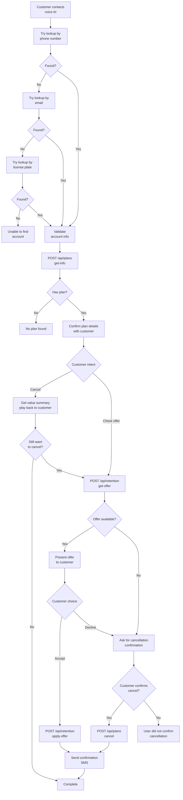
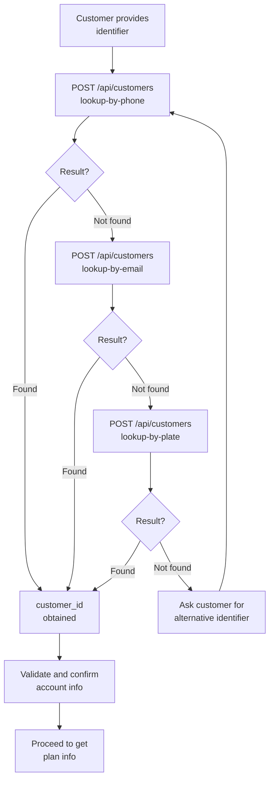
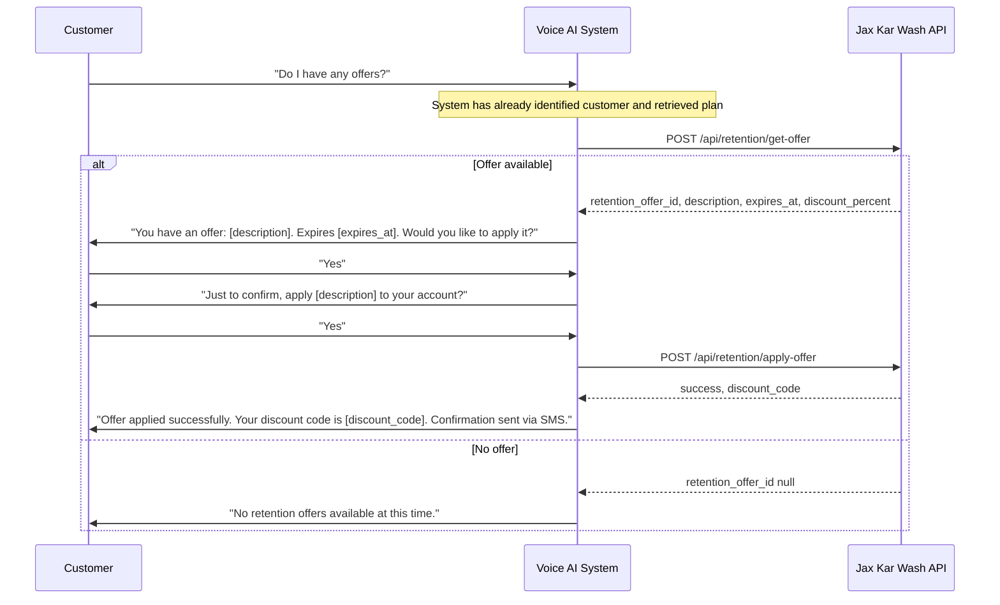
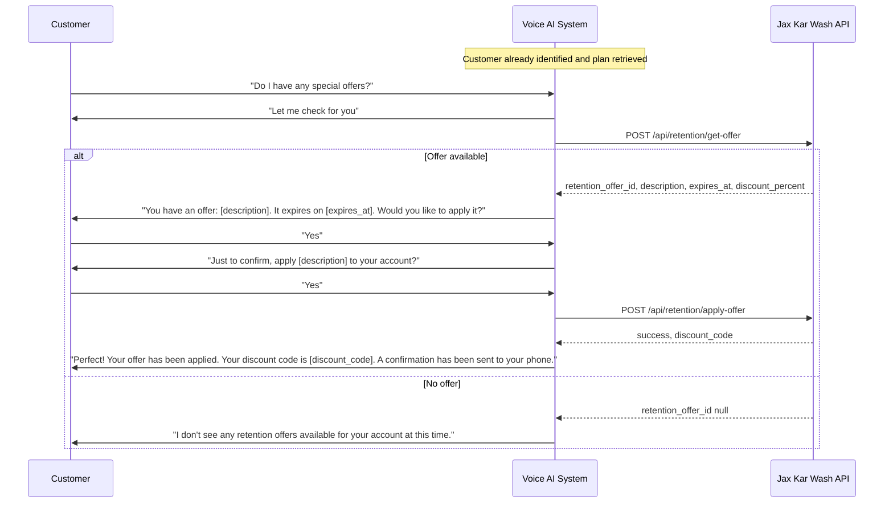
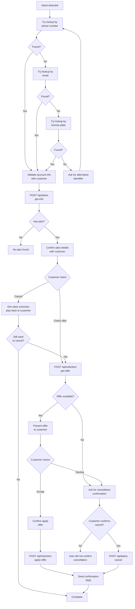
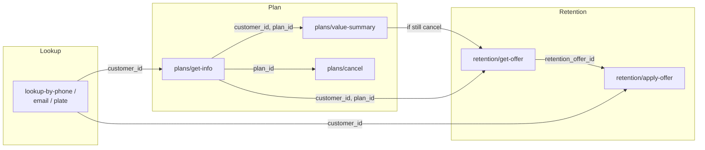

# Jax Kar Wash API Integration – Discussion Document

This document outlines proposed API endpoints, request/response formats, and flows for voice AI integration and is intended for discussion. Paths use `/api/` and can be adjusted to match your conventions. **All operations are POST** for consistency.

**Data hierarchy note:** We do not assume how Jax models accounts, members, plans, memberships, or vehicles. Terminology (e.g. "subscription", "plan", "membership") is used generically. Map our terms to your entities and IDs as appropriate. Where an endpoint could be "by account", "by member", or "by vehicle", we describe it generically so you can align with your structure.

**Workflow note:** The workflows and diagrams in this document represent our general plan for how the voice AI will interact with your API. More discussion with the tech teams and Meddy is expected to iron out specific workflow details, confirmation prompts, error handling, and edge cases. This document serves as a starting point for those discussions.

---

## Business context

As identified in previous meetings and discussions, the main pain point is **cancellation handling**: cancellation volume has created capacity constraints, and human capacity is not keeping pace. The goal is to reduce call and ticket workload and human labor by automating this aspect.

To do that, we need an API integration so that HelloWash systems can take action autonomously. We have two solution targets in mind: (1) **Voice AI** to handle incoming cancellation and retention conversations in real time, so fewer cancellation tickets are created; (2) an **AI agent** to work through existing tickets and backlog. Both depend on POS integration endpoints that allow these systems to look up customers, retrieve plan/membership info, present or apply retention offers, and cancel plans without manual steps. This document focuses on the API contract needed to support that integration.

---

## Design question: Single customer payload vs. multiple endpoints

**Can you provide a single “customer information” endpoint that returns one payload with all the data we need?**

Our preference is the **path of least resistance** (fewest API calls, simplest flow). Ideally we would call **one** endpoint (e.g. lookup by phone, email, or license plate) and receive a **single response** that already includes:

- Customer/member/account identifiers and profile (name, email, phone)
- Current plan/membership/subscription info (plan_id, plan_name, status, next_billing_date, etc.)
- Any vehicle or related data needed for validation or display
- **Value summary** (wash history / savings) for playback before retention: plan price, washes used in period, single-use price per wash, value saved (or components so we can compute it). If included, we do not need a separate value-summary call.

In that **best case**, we would only need to call your API in two steps for most flows:

1. **Get full customer info** (one POST with phone, email, or plate) → one response with customer + plan + any vehicles.
2. **Then**, depending on what the customer wants:
   - **Get retention offer** (e.g. `POST /api/retention/get-offer` with `customer_id` or whatever ID you return).
   - **Apply retention offer** (e.g. `POST /api/retention/apply-offer` with `retention_offer_id` and `customer_id`).
   - **Cancel plan** (e.g. `POST /api/plans/cancel` with `customer_id` and `plan_id` from the first response).

So we would **not** need to fetch the user’s plan, membership, account, or vehicles in separate calls if you can return them in that first payload.

**If you can support a single customer-information payload:** please confirm and share the response shape (or an example). We will align our flows and docs to use that as the primary path.

**If you need to keep separate endpoints** (lookup customer, then get plan info, then get vehicles, etc.): that is fine. The rest of this document describes that multi-call approach so we can implement either way. We just want to set the expectation and assumption up front: the path of least resistance is preferred, and a single customer data payload is the best-case scenario.

---

**What if the response includes multiple plans, accounts, or memberships?**

If a customer can have more than one plan, account, or membership, we need a clear way to **isolate the current active one** so we know which ID to use for cancellation and retention offers.

Please either:

- **Option A:** Return a single **active** plan/membership in the payload (e.g. the one that is current for this customer or this vehicle), and/or  
- **Option B:** If you return a list (e.g. `plans: [...]` or `memberships: [...]`), include a field we can use to identify the active one, for example:
  - `status: "active"` (or equivalent) on the relevant item, or  
  - A top-level field such as `active_plan_id`, `current_membership_id`, or `primary_account_id` that points to the one we should use for cancel and retention.

We need at least one **stable identifier for the active plan/membership** (whatever you call it) so we can pass it to get retention offer and to cancel. If the customer has multiple and we need to let them choose, we can support that in the voice flow (e.g. “You have Plan A and Plan B; which one do you want to cancel?”), but we need to know how to tell which is which in the payload (e.g. by `plan_id` + `plan_name` or similar). Lookup by phone or email may surface multiple plans or vehicles; lookup by license plate is usually scoped to one vehicle and its active plan, which simplifies cancellation when the customer is cancelling "for this car."

---

**Lookup by phone/email vs. by license plate**

- **Lookup by phone** and **lookup by email** may return **multiple results** (e.g. multiple plans, multiple vehicles, or a combination), because one person can have several accounts, plans, or vehicles. We need to handle that explicitly: either you return a single active/default when you can determine it, or a clear list with stable IDs (and optionally `plan_name` or vehicle info) so we can disambiguate in the voice flow (e.g. "You have Plan A on the Camry and Plan B on the Accord—which do you want to cancel?") and then use only the chosen IDs for get-info, value-summary, cancel, and retention.
- **Lookup by license plate** (and state) is scoped to **one vehicle**, so the response can naturally be that vehicle and its **active plan** (or the IDs we need for that car). That reduces ambiguity and avoids asking the customer for extra information when they are cancelling for that car. We want to request only what is necessary; when the caller identifies by plate, we can assume the response is for that vehicle's active plan unless you document otherwise.

---

## Overview: How the Voice AI Uses Your API

The voice AI identifies the customer, retrieves plan/membership info (or receives it in a single payload—see Design question above), and then either cancels the plan or handles retention offers. The diagrams below assume the **multi-call approach** (lookup, then get plan info, then value summary when cancelling, then get-offer/apply-offer/cancel). For cancellation intent we play back a value summary (wash history/savings) before retention; if that data is in the single payload, no separate value-summary call is needed. If Jax provides a **single customer-information payload** that already includes plan and value-summary data, the separate get plan info and value-summary steps can be omitted and we would use IDs from that first response for get-offer, apply-offer, and cancel.



**Customer identification with fallback:**



---

## Value summary and retention flow

Before presenting a **retention offer**, we play back a **value summary** to the customer so they can see what they’re getting from their plan. This happens only when the customer intent is to cancel.

**Context:** Plans have tiers (e.g. unlimited, N washes per period). Jax knows membership prices, wash history, and single-use wash prices. From that we can communicate: what the customer pays, how often they wash (e.g. X times per month), what each wash would cost without the plan, and the **value saved** (e.g. “You pay $25/month for unlimited; you’ve used 4 washes this month; at $15 each that’s $60 value—you’ve saved $35”). The voice AI will phrase this in natural language from a **structured JSON payload**; exact wording is not fixed in the API.

**Flow:**

1. Customer is identified and plan is confirmed (lookup + get plan info, or single customer payload).
2. Customer indicates they want to cancel.
3. **Play back value summary** using data from the value-summary endpoint (or from get-info / single payload if it includes this data). No retention offer yet.
4. If the customer **still wants to cancel** after hearing the value summary → call **get retention offer**. The retention offer is a concrete incentive (e.g. $Z discount over N months applied to the account) that the customer can accept or decline.
5. If customer **accepts** the retention offer → apply-offer, then complete. If customer **declines** → ask for cancellation confirmation, then cancel if confirmed.

So the order is: **value summary (playback) first** → if still cancelling, **then** present the retention offer (accept/decline) → then apply-offer or confirm cancel.

---

## Endpoint Priority

| Priority | Purpose | Endpoints |
|----------|---------|-----------|
| **Priority (support first)** | Identify customer, get plan/membership info, value summary for playback, trigger cancellation, and retention offer exchange | Look up by phone, email, or license plate; get plan info; get value summary (wash history/savings); cancel plan; get retention offer; apply retention offer |
| **Lower priority (useful later)** | Deeper data and lifecycle operations | Get vehicle/data by identifier, create plan/membership (if needed) |

---

## Base Configuration

**Base URL:** `https://api.jaxkarwash.example.com` (or your chosen host)

**Authentication:** You can choose your own authentication mechanism (e.g. API key, Bearer token, tenant headers). The following is an example we use for illustration:
- Header: `Api-Key` (required in this example)
- Header: `X-Tenant-Id` (optional, for multi-tenant in this example)

**Content-Type:** `application/json` for all POST requests

---

## Priority Endpoints (Support First)

The endpoints below are what we expect to need for the core voice AI flows: identify the customer, understand their plan/membership, play back value summary when cancelling, perform cancellation, and handle retention offers. If a single customer-information endpoint returns plan and value-summary data in one payload, the separate “Get plan info” (section 4) and “Get value summary” (section 5) calls may not be needed.

---

### 1. Lookup Customer by Phone

**Priority:** Yes

**Purpose:** Identify the customer by phone number. Used at call start and when the caller is identified by phone.

**Endpoint:** `POST /api/customers/lookup-by-phone`

**Request Body:**
```json
{
  "phone": "5551234567"
}
```
*Phone can be normalized (e.g. 10 digits, no +1); document your expected format.*

**Response (200 – found):**
```json
{
  "customer_id": "12345",
  "name": "John Doe",
  "email": "john.doe@example.com",
  "phone_number": "5551234567",
  "status": "active"
}
```
*Return whatever stable identifier you use for the customer (`customer_id`, `member_id`, `account_id`, etc.). We use it in later calls.*

*Depending on your data, this may return multiple plans or vehicles for one phone number. If so, either return a single active/default or a list with clear identifiers so we can disambiguate with the customer and use only the chosen plan/vehicle for subsequent calls.*

**Response (404 – not found):**
```json
{
  "error": "Customer not found",
  "message": "No customer found for this phone number"
}
```

---

### 2. Lookup Customer by Email

**Priority:** Yes

**Purpose:** Identify the customer by email when they use email instead of phone.

**Endpoint:** `POST /api/customers/lookup-by-email`

**Request Body:**
```json
{
  "email": "john.doe@example.com"
}
```

**Response (200 – found):** Same shape as lookup-by-phone (include your customer/member/account identifier and name, email, etc.). As with phone, the response may include multiple plans or vehicles; we need either a single active/default or a clear list for disambiguation.

**Response (404 – not found):** Same pattern as lookup-by-phone.

---

### 3. Lookup Customer by License Plate

**Priority:** Yes

**Purpose:** Identify the customer when they provide license plate (and state) instead of phone or email.

**Endpoint:** `POST /api/customers/lookup-by-plate`

**Request Body:**
```json
{
  "license_plate": "ABC123",
  "state": "CA"
}
```

**Response (200 – found):**
```json
{
  "customer_id": "12345",
  "name": "John Doe",
  "vehicle_id": "v789",
  "license_plate": "ABC123",
  "state": "CA"
}
```
*If your hierarchy uses something other than `customer_id` or `vehicle_id`, use your IDs; we will pass them back in subsequent requests.*

*Because the request is keyed by vehicle (plate + state), the response is typically one vehicle and its active plan (or the IDs needed for that vehicle). That scoping lets us proceed without asking for more information when the customer is cancelling for that car.*

**Response (404 – not found):** Same pattern as above.

---

### 4. Get Plan / Membership / Subscription Info

**Priority:** Yes (unless a single customer-information payload already includes this data—see Design question at the top.)

**Purpose:** Retrieve the customer’s current plan, membership, or subscription so we can confirm what they have and obtain any ID needed for cancellation or retention. We use “plan/membership/subscription” generically; map to your entity (e.g. subscription, membership, plan).

**Endpoint:** `POST /api/plans/get-info`  
*(Or `/api/membership/get-info`, `/api/subscription/get-info`, etc. – path is flexible.)*

**Request Body:**
```json
{
  "customer_id": "12345"
}
```
*If you key by something else (e.g. `member_id`, `account_id`), use that field name; we will send back the identifier you returned from lookup.*

**Response (200 – has active plan):**
```json
{
  "plan_id": "sub456",
  "customer_id": "12345",
  "status": "active",
  "plan_name": "Unlimited Monthly",
  "start_date": "2025-01-15",
  "next_billing_date": "2026-03-15",
  "auto_renew": true
}
```
*Use your real field names. We need at least one stable ID for the plan/membership/subscription (e.g. `plan_id`, `subscription_id`, `membership_id`) to use in cancel and optionally in retention.*

**Response (200 – no active plan):**
```json
{
  "plan_id": null,
  "customer_id": "12345",
  "status": "none",
  "message": "No active plan or membership found"
}
```

---

### 5. Get value summary (wash history / savings)

**Priority:** Yes (for cancellation flow)

**Purpose:** Return structured data so the voice AI can play back to the customer how much value they get from their plan before we present a retention offer. Plans have tiers and wash allowances (e.g. unlimited, or N washes per day/week/month). Jax knows membership prices, wash history, and single-use wash prices. We need either the raw numbers (plan price, washes used, single-use price per wash) or pre-calculated value saved. The voice AI will phrase the message from this payload; exact wording is not fixed by the API.

**Endpoint:** `POST /api/plans/value-summary`  
*(Or `/api/membership/value-summary`, `/api/usage/summary`, etc. – path is flexible. This data can also be included in get-info or in the single customer-information payload; if so, a separate call is not needed.)*

**Request Body:**
```json
{
  "customer_id": "12345",
  "plan_id": "sub456"
}
```
*Use the same IDs returned from lookup and get-info.*

**Response (200):**
```json
{
  "customer_id": "12345",
  "plan_id": "sub456",
  "plan_name": "Unlimited Monthly",
  "plan_tier": "unlimited",
  "plan_price": 25.00,
  "plan_price_currency": "USD",
  "period_type": "month",
  "period_start": "2026-02-01",
  "period_end": "2026-02-28",
  "washes_used_in_period": 4,
  "single_use_price_per_wash": 15.00,
  "value_of_washes_at_single_use": 60.00,
  "value_saved_in_period": 35.00
}
```
*Field names can follow your model. We need at least: what the customer pays for the plan, how many washes they used in the period, what a single wash costs without the plan, and either value_saved or the components so we can communicate “you saved $X” or equivalent. If you prefer to return only components (e.g. plan_price, washes_used_in_period, single_use_price_per_wash), we can compute value_saved on our side.*

**Response (404 – e.g. no plan or no usage data):** Standard error body; we will skip value playback and proceed to get retention offer or confirm cancel.

---

### 6. Cancel Plan / Apply Cancellation

**Priority:** Yes

**Purpose:** Cancel the customer’s plan, membership, or subscription. Naming on your side can be “cancel plan”, “apply cancellation”, “cancel subscription”, etc.; the intention is to cancel.

**Endpoint:** `POST /api/plans/cancel`  
*(Or `/api/subscription/cancel`, `/api/cancellation/apply`, etc.)*

**Request Body:**
```json
{
  "customer_id": "12345",
  "plan_id": "sub456",
  "cancel_at_period_end": true,
  "cancellation_reason": "Customer requested"
}
```
*`plan_id` is the ID you returned from “get plan/membership info”. If you use `subscription_id` or `membership_id`, use that name.*

**Response (200 – success):**
```json
{
  "success": true,
  "message": "Plan cancelled successfully",
  "plan_id": "sub456",
  "cancellation_date": "2026-02-20",
  "effective_date": "2026-03-15",
  "cancel_at_period_end": true
}
```

**Response (400 – e.g. already cancelled):**
```json
{
  "success": false,
  "error": "Invalid request",
  "message": "Plan is already cancelled"
}
```

---

### 7. Get Retention Offer

**Priority:** Yes

**Purpose:** Check whether the customer has a retention offer. The response should include a **retention_offer_id** (or equivalent) for use in apply. How you link the offer to your data (plan, account, membership, etc.) is up to your model; we only need a stable offer ID to pass to apply.

**Endpoint:** `POST /api/retention/get-offer`

**Request Body:**
```json
{
  "customer_id": "12345",
  "plan_id": "sub456"
}
```
*Include whatever IDs you need to look up the offer (e.g. customer + plan, or account + membership).*

**Response (200 – offer available):**
```json
{
  "retention_offer_id": "offer789",
  "customer_id": "12345",
  "description": "50% off next wash",
  "discount_percent": 50,
  "expires_at": "2026-03-01T00:00:00Z",
  "terms": "Valid for one-time use"
}
```
*`retention_offer_id` must be unique and usable in the apply endpoint. You can also include IDs that tie to your hierarchy (e.g. plan_id, account_id) if needed.*

**Response (200 – no offer):**
```json
{
  "retention_offer_id": null,
  "customer_id": "12345",
  "message": "No retention offers available"
}
```

---

### 8. Apply Retention Offer

**Priority:** Yes

**Purpose:** Apply or redeem a retention offer. Uses the **retention_offer_id** from get-offer and a customer/member/account identifier so the offer is applied in line with your data model.

**Endpoint:** `POST /api/retention/apply-offer`

**Request Body:**
```json
{
  "retention_offer_id": "offer789",
  "customer_id": "12345"
}
```
*If you need additional IDs (e.g. plan_id, account_id, membership_id) to apply the offer, add those fields; we can pass back any IDs you returned in get-offer or get-info.*

**Response (200 – success):**
```json
{
  "success": true,
  "message": "Offer applied successfully",
  "retention_offer_id": "offer789",
  "customer_id": "12345",
  "applied_at": "2026-02-20T14:30:00Z",
  "discount_code": "WASH50-789"
}
```

**Response (400/404 – e.g. expired or invalid):**
```json
{
  "success": false,
  "error": "Offer expired",
  "message": "This offer expired on 2026-03-01"
}
```

---

## Lower Priority Endpoints (Useful Later)

These support richer flows and lifecycle operations. We do not assume your hierarchy (e.g. account vs member vs vehicle); design paths and request fields to match your model.

---

### 9. Get Vehicle / Related Data by Identifier

**Priority:** Lower

**Purpose:** Get vehicle (or related) data when the voice AI flow needs it. We do not assume whether data is keyed by account, member, vehicle, or something else; the endpoint should accept whatever identifier fits your hierarchy.

**Endpoint:** `POST /api/data/get-by-identifier`  
*(Or `/api/vehicles/get-by-account`, `/api/members/get-vehicles`, etc. – name and path to match your model.)*

**Request Body (example – by account/customer):**
```json
{
  "customer_id": "12345"
}
```
*Alternatively you might use `account_id`, `member_id`, `vehicle_id`, or a combination; document what you need.*

**Response (200):**
```json
{
  "data": [
    {
      "vehicle_id": "v789",
      "license_plate": "ABC123",
      "state": "CA",
      "make": "Toyota",
      "model": "Camry",
      "plan_id": "sub456",
      "plan_status": "active"
    }
  ]
}
```
*Structure can follow your hierarchy (e.g. vehicles with nested or linked plan/membership). We need enough to support cancellation or retention if this path is used in those flows.*

**Response (200 – empty):**
```json
{
  "data": []
}
```

---

### 10. Get Plan / Membership / Subscription (by alternative key)

**Priority:** Lower

**Purpose:** Same as Priority endpoint 4, but keyed by something other than customer (e.g. vehicle_id, account_id, membership_id) if your model works that way.

**Endpoint:** `POST /api/plans/get-info-by-key`  
*(Path and name can vary.)*

**Request Body (example):**
```json
{
  "vehicle_id": "v789"
}
```
*Or `account_id`, `membership_id`, etc., depending on your hierarchy.*

**Response:** Same idea as Priority endpoint 4: return plan/membership/subscription info and the ID(s) needed for cancel and retention.

---

### 11. Create Plan / Membership / Subscription

**Priority:** Lower

**Purpose:** Create or enroll in a plan/membership/subscription when your business process supports it via API. Not required for the initial cancellation and retention flows.

**Endpoint:** `POST /api/plans/create`  
*(Or equivalent path for membership/subscription creation.)*

**Request Body:** To be defined based on your required fields (e.g. customer_id, plan type, vehicle_id, start date).

**Response:** Return the created resource and its IDs so they can be used in get-info and cancel if needed.

---

## Operational Flows (Priority)

**Note:** The flows below illustrate the general approach with validation, confirmation, and error handling. Specific prompts, confirmation wording, and error recovery strategies will be refined through discussion with tech teams and Meddy.

### Flow 1: Cancel by Phone

```mermaid
sequenceDiagram
    participant Customer
    participant System as Voice AI System
    participant API as Jax Kar Wash API

    Customer->>System: "I want to cancel"
    System->>API: POST /api/customers/lookup-by-phone
    alt Customer found
        API-->>System: customer_id, name, email
        System->>Customer: "I found your account. Is this John Doe?"
        Customer->>System: "Yes"
        System->>API: POST /api/plans/get-info
        API-->>System: plan_id, plan_name, status
        System->>Customer: "You have [plan_name]. Is this correct?"
        Customer->>System: "Yes"
        System->>API: POST /api/plans/value-summary
        API-->>System: plan_price, washes_used, single_use_price, value_saved
        System->>Customer: Play back value summary (e.g. savings, usage)
        Customer->>System: Still want to cancel / Changed mind
        alt Still want to cancel
        System->>API: POST /api/retention/get-offer
        alt Offer available
            API-->>System: retention_offer_id, description
            System->>Customer: "We have an offer: [description]. Would you like to keep your plan?"
            alt Customer accepts offer
                Customer->>System: "Yes, I'll keep it"
                System->>API: POST /api/retention/apply-offer
                API-->>System: success
                System->>Customer: "Offer applied. Confirmation sent via SMS."
            else Customer declines
                Customer->>System: "No, cancel it"
                System->>Customer: "Just to confirm, you want to cancel [plan_name]?"
                Customer->>System: "Yes"
                System->>API: POST /api/plans/cancel
                API-->>System: success, effective_date
                System->>Customer: "Cancelled. Access until [date]. Confirmation sent via SMS."
            end
        else No offer
            API-->>System: retention_offer_id null
            System->>Customer: "Just to confirm, you want to cancel [plan_name]?"
            Customer->>System: "Yes"
            System->>API: POST /api/plans/cancel
            API-->>System: success, effective_date
            System->>Customer: "Cancelled. Access until [date]. Confirmation sent via SMS."
        end
        end
        else Customer changed mind
            Note over System, Customer: No cancel; complete
        end
    else Customer not found
        API-->>System: error: Customer not found
        System->>Customer: "I couldn't find an account. Can you provide your email or license plate?"
        Customer->>System: Provides alternative identifier
        Note over System: System tries alternative lookup method
    end
```

---

### Flow 2: Cancel by License Plate

```mermaid
sequenceDiagram
    participant Customer
    participant System as Voice AI System
    participant API as Jax Kar Wash API

    Customer->>System: "Cancel for plate ABC123, CA"
    System->>API: POST /api/customers/lookup-by-plate
    alt Vehicle found
        API-->>System: customer_id, name, vehicle_id
        System->>Customer: "I found account for [name]. Is this correct?"
        Customer->>System: "Yes"
        System->>API: POST /api/plans/get-info
        alt Plan found
            API-->>System: plan_id, plan_name, status
            System->>Customer: "You have [plan_name] for this vehicle. Correct?"
            Customer->>System: "Yes"
            System->>API: POST /api/plans/value-summary
            API-->>System: plan_price, washes_used, single_use_price, value_saved
            System->>Customer: Play back value summary (e.g. savings, usage)
            Customer->>System: Still want to cancel / Changed mind
            alt Still want to cancel
            System->>API: POST /api/retention/get-offer
            alt Offer available
                API-->>System: retention_offer_id, description
                System->>Customer: "We have an offer: [description]. Keep your plan?"
                alt Customer accepts
                    Customer->>System: "Yes"
                    System->>API: POST /api/retention/apply-offer
                    API-->>System: success
                    System->>Customer: "Offer applied. Confirmation sent via SMS."
                else Customer declines
                    Customer->>System: "No, cancel"
                    System->>Customer: "Confirm cancellation of [plan_name]?"
                    Customer->>System: "Yes"
                    System->>API: POST /api/plans/cancel
                    API-->>System: success, effective_date
                    System->>Customer: "Cancelled. Access until [date]. Confirmation sent via SMS."
                end
            else No offer
                API-->>System: retention_offer_id null
                System->>Customer: "Confirm cancellation of [plan_name]?"
                Customer->>System: "Yes"
                System->>API: POST /api/plans/cancel
                API-->>System: success, effective_date
                System->>Customer: "Cancelled. Access until [date]. Confirmation sent via SMS."
            end
            end
            else Customer changed mind
                Note over System, Customer: No cancel; complete
            end
        else No plan
            API-->>System: plan_id null
            System->>Customer: "No active plan found for this vehicle."
        end
    else Vehicle not found
        API-->>System: error: Vehicle not found
        System->>Customer: "I couldn't find that plate. Can you provide your phone number or email?"
        Customer->>System: Provides alternative identifier
        Note over System: System tries alternative lookup method
    end
```

---

### Flow 3: Retention Offer – Get and Apply



---

### Flow 4: Cancel by Email

```mermaid
sequenceDiagram
    participant Customer
    participant System as Voice AI System
    participant API as Jax Kar Wash API

    Customer->>System: "Cancel my plan"
    System->>Customer: "What's your email address?"
    Customer->>System: "john@example.com"
    System->>API: POST /api/customers/lookup-by-email
    alt Customer found
        API-->>System: customer_id, name
        System->>Customer: "I found account for [name]. Is this correct?"
        Customer->>System: "Yes"
        System->>API: POST /api/plans/get-info
        API-->>System: plan_id, plan_name
        System->>Customer: "You have [plan_name]. Correct?"
        Customer->>System: "Yes"
        System->>API: POST /api/plans/value-summary
        API-->>System: plan_price, washes_used, single_use_price, value_saved
        System->>Customer: Play back value summary (e.g. savings, usage)
        Customer->>System: Still want to cancel / Changed mind
        alt Still want to cancel
        System->>API: POST /api/retention/get-offer
        alt Offer available
            API-->>System: retention_offer_id, description
            System->>Customer: "We have an offer: [description]. Keep your plan?"
            alt Customer accepts
                Customer->>System: "Yes"
                System->>API: POST /api/retention/apply-offer
                API-->>System: success
                System->>Customer: "Offer applied. Confirmation sent via SMS."
            else Customer declines
                Customer->>System: "No, cancel"
                System->>Customer: "Confirm cancellation of [plan_name]?"
                Customer->>System: "Yes"
                System->>API: POST /api/plans/cancel
                API-->>System: success, effective_date
                System->>Customer: "Cancelled. Access until [date]. Confirmation sent via SMS."
            end
        else No offer
            API-->>System: retention_offer_id null
            System->>Customer: "Confirm cancellation of [plan_name]?"
            Customer->>System: "Yes"
            System->>API: POST /api/plans/cancel
            API-->>System: success, effective_date
            System->>Customer: "Cancelled. Access until [date]. Confirmation sent via SMS."
        end
        end
        else Customer changed mind
            Note over System, Customer: No cancel; complete
        end
    else Customer not found
        API-->>System: error: Customer not found
        System->>Customer: "I couldn't find that email. Can you provide your phone number or license plate?"
        Customer->>System: Provides alternative identifier
        Note over System: System tries alternative lookup method
    end
```

---

### Flow 5: Full Cancellation Flow (Detailed – by Phone)

End-to-end sequence showing validation, confirmation, and retention offer handling.

```mermaid
sequenceDiagram
    participant Customer
    participant System as Voice AI System
    participant API as Jax Kar Wash API

    Customer->>System: "I want to cancel my plan"
    System->>Customer: "Let me look that up for you"
    System->>API: POST /api/customers/lookup-by-phone
    alt Customer found
        API-->>System: customer_id, name, email
        System->>Customer: "I found an account for [name] at [email]. Is this correct?"
        Customer->>System: "Yes"
        System->>API: POST /api/plans/get-info
        alt Plan found
            API-->>System: plan_id, plan_name, status, next_billing_date
            System->>Customer: "You have [plan_name]. Your next billing is [date]. Is this correct?"
            Customer->>System: "Yes"
            System->>API: POST /api/plans/value-summary
            API-->>System: plan_price, washes_used, single_use_price, value_saved
            System->>Customer: Play back value summary (e.g. savings, usage)
            Customer->>System: Still want to cancel / Changed mind
            alt Still want to cancel
            System->>API: POST /api/retention/get-offer
            alt Offer available
                API-->>System: retention_offer_id, description, discount_percent
                System->>Customer: "Before we cancel, we have an offer: [description]. Would you like to keep your plan with this offer?"
                alt Customer accepts
                    Customer->>System: "Yes, I'll keep it"
                    System->>Customer: "Just to confirm, apply [description]?"
                    Customer->>System: "Yes"
                    System->>API: POST /api/retention/apply-offer
                    API-->>System: success, discount_code
                    System->>Customer: "Great! Your offer has been applied. Your discount code is [discount_code]. A confirmation has been sent to your phone."
                else Customer declines
                    Customer->>System: "No, I still want to cancel"
                    System->>Customer: "I understand. Just to confirm, you want to cancel [plan_name] effective [date]?"
                    Customer->>System: "Yes"
                    System->>API: POST /api/plans/cancel
                    API-->>System: success, effective_date
                    System->>Customer: "Your plan has been cancelled. You'll have access until [effective_date]. A confirmation has been sent to your phone."
                end
            else No offer
                API-->>System: retention_offer_id null
                System->>Customer: "I understand you want to cancel [plan_name]. Just to confirm, cancel effective [next_billing_date]?"
                Customer->>System: "Yes"
                System->>API: POST /api/plans/cancel
                API-->>System: success, effective_date
                System->>Customer: "Your plan has been cancelled. Access until [effective_date]. Confirmation sent to your phone."
            end
            end
            else Customer changed mind
                Note over System, Customer: No cancel; complete
            end
        else No plan
            API-->>System: plan_id null
            System->>Customer: "I don't see an active plan on your account."
        end
    else Customer not found
        API-->>System: error: Customer not found
        System->>Customer: "I couldn't find an account with that phone number. Can you provide your email address or license plate?"
        Customer->>System: Provides alternative
        Note over System: System tries alternative lookup method
    end
```

---

### Flow 6: Full Cancellation Flow (Detailed – by License Plate)

```mermaid
sequenceDiagram
    participant Customer
    participant System as Voice AI System
    participant API as Jax Kar Wash API

    Customer->>System: "Cancel for plate ABC123, California"
    System->>Customer: "Let me look that up"
    System->>API: POST /api/customers/lookup-by-plate
    alt Vehicle found
        API-->>System: customer_id, name, vehicle_id
        System->>Customer: "I found an account for [name] with plate ABC123. Is this correct?"
        Customer->>System: "Yes"
        System->>API: POST /api/plans/get-info
        alt Plan found
            API-->>System: plan_id, plan_name, status
            System->>Customer: "You have [plan_name] for this vehicle. Is this correct?"
            Customer->>System: "Yes"
            System->>API: POST /api/plans/value-summary
            API-->>System: plan_price, washes_used, single_use_price, value_saved
            System->>Customer: Play back value summary (e.g. savings, usage)
            Customer->>System: Still want to cancel / Changed mind
            alt Still want to cancel
            System->>API: POST /api/retention/get-offer
            alt Offer available
                API-->>System: retention_offer_id, description
                System->>Customer: "We have an offer: [description]. Would you like to keep your plan?"
                alt Customer accepts
                    Customer->>System: "Yes"
                    System->>Customer: "Confirm applying [description]?"
                    Customer->>System: "Yes"
                    System->>API: POST /api/retention/apply-offer
                    API-->>System: success
                    System->>Customer: "Offer applied. Confirmation sent via SMS."
                else Customer declines
                    Customer->>System: "No, cancel it"
                    System->>Customer: "Confirm cancellation of [plan_name]?"
                    Customer->>System: "Yes"
                    System->>API: POST /api/plans/cancel
                    API-->>System: success, effective_date
                    System->>Customer: "Cancelled. Access until [date]. Confirmation sent via SMS."
                end
            else No offer
                API-->>System: retention_offer_id null
                System->>Customer: "Confirm cancellation of [plan_name]?"
                Customer->>System: "Yes"
                System->>API: POST /api/plans/cancel
                API-->>System: success, effective_date
                System->>Customer: "Cancelled. Access until [date]. Confirmation sent via SMS."
            end
            end
            else Customer changed mind
                Note over System, Customer: No cancel; complete
            end
        else No plan
            API-->>System: plan_id null
            System->>Customer: "No active plan found for this vehicle."
        end
    else Vehicle not found
        API-->>System: error: Vehicle not found
        System->>Customer: "I couldn't find that plate. Can you provide your phone number or email?"
        Customer->>System: Provides alternative
        Note over System: System tries alternative lookup method
    end
```

---

### Flow 7: Retention Offer – Get Then Apply (Detailed)



---

### API Call Decision Tree

Which API endpoints the system calls depends on how the customer is identified and what they want to do. All calls are POST. This diagram shows the decision points including validation, confirmation, and error handling.



---

### ID Flow Between Endpoints

IDs returned from one endpoint are passed into the next. This diagram shows the minimal set for the **multi-call approach**. If a single customer-information payload is used, `customer_id` and `plan_id` (and optionally value-summary data) may come from that first response, and the separate get plan info and value-summary calls may be skipped.



---

## Error Handling

**Standard error body:**
```json
{
  "error": "Error type",
  "message": "Human-readable message"
}
```

**HTTP status codes:**
- `200` – Success (including “no offer” or “no plan”)
- `400` – Invalid input or business rule (e.g. already cancelled)
- `401` – Invalid or missing API key
- `404` – Resource not found (customer, plan, offer, or value-summary e.g. no usage data)
- `500` – Server error

Always return JSON. For cancel and apply-offer, include `success: true` or `success: false` in the body where applicable.

---

## Request/Response Summary

Two possible integration approaches. We prefer **Best case** (fewest calls); **Multi-call** is the alternative if you keep lookup and plan info separate.

### Best case – single initial payload

One lookup endpoint (by phone, email, or plate) returns **customer + plan + any vehicles** in one response. We use the returned IDs for all follow-on calls; no separate get-plan call.

| Step | Operation | Endpoint (example) | Key request fields | Key response fields |
|------|-----------|--------------------|--------------------|----------------------|
| 1 | Get full customer info | e.g. `POST /api/customers/lookup-by-phone` (or lookup-by-email, lookup-by-plate) | `phone` (or `email`, or `license_plate` + `state`) | `customer_id`, `plan_id`, name, email, plan_name, status, next_billing_date, vehicle data, value summary (or separate call) |
| 2 | Get value summary (if not in step 1) | `POST /api/plans/value-summary` | `customer_id`, `plan_id` (from step 1) | plan_price, washes_used_in_period, single_use_price_per_wash, value_saved_in_period (or components) |
| 3 | Get retention offer | `POST /api/retention/get-offer` | `customer_id`, `plan_id` (from step 1) | `retention_offer_id`, description, expires_at |
| 3 | Apply retention offer | `POST /api/retention/apply-offer` | `retention_offer_id`, `customer_id` (from step 1) | `success`, message, retention_offer_id, discount_code |
| 3 | Cancel plan | `POST /api/plans/cancel` | `customer_id`, `plan_id`, `cancel_at_period_end` (from step 1) | `success`, message, effective_date |

### Multi-call – separate lookup and get plan

Lookup returns customer only; we then call get-info for plan data, then (when cancelling) value-summary for playback, then get-offer / apply-offer / cancel as needed.

| Step | Operation | Endpoint (example) | Key request fields | Key response fields |
|------|-----------|--------------------|--------------------|----------------------|
| 1 | Lookup by phone | `POST /api/customers/lookup-by-phone` | `phone` | `customer_id`, name, email (may be multiple plans/vehicles) |
| 1 | Lookup by email | `POST /api/customers/lookup-by-email` | `email` | same as phone (may be multiple plans/vehicles) |
| 1 | Lookup by plate | `POST /api/customers/lookup-by-plate` | `license_plate`, `state` | `customer_id`, name, vehicle_id (typically one vehicle + active plan) |
| 2 | Get plan info | `POST /api/plans/get-info` | `customer_id` (from step 1) | `plan_id`, status, plan_name |
| 2 | Get value summary | `POST /api/plans/value-summary` | `customer_id`, `plan_id` (from step 1–2) | plan_price, washes_used_in_period, single_use_price_per_wash, value_saved_in_period (or components) |
| 3 | Get retention offer | `POST /api/retention/get-offer` | `customer_id`, optionally `plan_id` | `retention_offer_id`, description, expires_at |
| 3 | Apply retention offer | `POST /api/retention/apply-offer` | `retention_offer_id`, `customer_id` | `success`, message, retention_offer_id, discount_code |
| 3 | Cancel plan | `POST /api/plans/cancel` | `customer_id`, `plan_id`, `cancel_at_period_end` | `success`, message, effective_date |
| — | Get data by identifier | `POST /api/data/get-by-identifier` | Your identifier(s) | Your structure |
| — | Get plan by key | `POST /api/plans/get-info-by-key` | e.g. vehicle_id, account_id | Same as get-info |
| — | Create plan | `POST /api/plans/create` | Per your requirements | Created resource + IDs |

---

## Testing Recommendations

1. **Priority endpoints first:** Look up by phone, email, or license plate; get plan info; get value summary (for cancellation flow); cancel; get retention offer; apply retention offer.
2. **Multiple results:** Test phone and email lookup when the customer has multiple plans or vehicles (disambiguation or single active); test plate lookup for a single vehicle and its active plan.
3. **Error cases:** Not found, invalid IDs, already cancelled, expired offer, invalid phone/email/plate format.
4. **ID consistency:** Same identifier from lookup (and get-info when used) is used for value-summary, cancel, and retention; retention_offer_id from get-offer is used in apply-offer. If using a single customer payload, customer_id and plan_id from that response are used for subsequent calls.
5. **Hierarchy:** If you use account/member/vehicle distinctions, test with the IDs and field names that match your model.

---

## Next Steps

This document outlines the general plan for API integration. The specific workflows, confirmation prompts, error handling strategies, and edge cases will be refined through ongoing discussions with the tech teams and Meddy. Endpoint paths, request/response formats, and field names can be adjusted to align with Jax's existing API structure and conventions.

---

For questions about integration, endpoint naming, or mapping to your data model, reach out to the tech teams or Meddy to continue the discussion.
