# Jax Kar Wash API Integration – Discussion Document

This document outlines proposed API endpoints, request/response formats, and flows for voice AI integration and is intended for discussion. Paths use `/api/` and can be adjusted to match your conventions.

**Data hierarchy note:** We do not assume how Jax models accounts, members, plans, memberships, or vehicles. Terminology (e.g. "subscription", "plan", "membership") is used generically. Map our terms to your entities and IDs as appropriate. Where an endpoint could be "by account", "by member", or "by vehicle", we describe it generically so you can align with your structure.

**Workflow note:** The workflows and diagrams in this document represent our general plan for how the voice AI will interact with your API. More discussion with the tech teams and Meddy is expected to iron out specific workflow details, confirmation prompts, error handling, and edge cases. This document serves as a starting point for those discussions.

**API flexibility:** Endpoint names, paths, and response shapes in this document are illustrative. We will align to Jax's grouping (e.g. one combined value-summary + retention-offer endpoint). **Key terms** used throughout: *value summary* = wash history/savings for playback before retention; *retention offer* = the offer we present and may apply.

---

## Table of contents

- [Business context](#business-context)
- [Integration approach](#integration-approach)
- [Endpoint grouping options](#endpoint-grouping-options)
- [Overview: How the Voice AI Uses Your API](#overview-how-the-voice-ai-uses-your-api)
- [Value summary and retention flow](#value-summary-and-retention-flow)
- [Endpoint Priority](#endpoint-priority)
- [Base Configuration](#base-configuration)
- [Priority Endpoints (Support First)](#priority-endpoints-support-first)
  - [1. Lookup Customer by Phone](#1-lookup-customer-by-phone)
  - [2. Lookup Customer by Email](#2-lookup-customer-by-email)
  - [3. Lookup Customer by License Plate](#3-lookup-customer-by-license-plate)
  - [4. Get Plan / Membership / Subscription Info](#4-get-plan--membership--subscription-info)
  - [5. Get value summary (wash history / savings)](#5-get-value-summary-wash-history--savings)
  - [6. Cancel Plan / Apply Cancellation](#6-cancel-plan--apply-cancellation)
  - [7. Get Retention Offer](#7-get-retention-offer)
  - [8. Apply Retention Offer](#8-apply-retention-offer)
- [Lower Priority Endpoints (Useful Later)](#lower-priority-endpoints-useful-later)
  - [9. Get Vehicle / Related Data by Identifier](#9-get-vehicle--related-data-by-identifier)
  - [10. Get Plan / Membership / Subscription (by alternative key)](#10-get-plan--membership--subscription-by-alternative-key)
  - [11. Create Plan / Membership / Subscription](#11-create-plan--membership--subscription)
- [Operational Flows (Priority)](#operational-flows-priority)
  - [Flow 1: Cancel by Phone](#flow-1-cancel-by-phone)
  - [Flow 2: Cancel by License Plate](#flow-2-cancel-by-license-plate)
  - [Flow 3: Retention Offer – Get and Apply](#flow-3-retention-offer--get-and-apply)
  - [Flow 4: When Lookup by Phone Fails – Identify by Email](#flow-4-when-lookup-by-phone-fails--identify-by-email)
  - [Flow 5 and 6: Full Cancellation (Detailed)](#flow-5-and-6-full-cancellation-detailed)
  - [API Call Decision Tree](#api-call-decision-tree)
  - [ID Flow Between Endpoints](#id-flow-between-endpoints)
- [Error Handling](#error-handling)
- [Request/Response Summary](#requestresponse-summary)
  - [Request/Response flow](#requestresponse-flow)
- [Testing Recommendations](#testing-recommendations)
- [Next Steps](#next-steps)
- [Future discussion: all-in-one option](#future-discussion-all-in-one-option)

---

## Business context

As identified in previous meetings and discussions, the main pain point is **cancellation handling**: cancellation volume has created capacity constraints, and human capacity is not keeping pace. The goal is to reduce call and ticket workload and human labor by automating this aspect.

To do that, we need an API integration so that HelloWash systems can take action autonomously. We have two solution targets in mind: (1) **Voice AI** to handle incoming cancellation and retention conversations in real time, so fewer cancellation tickets are created; (2) an **AI agent** to work through existing tickets and backlog. Both depend on POS integration endpoints that allow these systems to look up customers, retrieve plan/membership info, present or apply retention offers, and cancel plans without manual steps. This document focuses on the API contract needed to support that integration.

---

## Integration approach

This document assumes the following flow. **Lookup by phone** returns **customer + plan + vehicle**; we disambiguate if needed (email, license plate, or clarifying questions). Once the plan is isolated, we fetch **value summary** and **retention offer** (one combined endpoint or separate endpoints). **If value summary or offer are missing**, we do not present the retention path to the customer. **If both exist**, we play the value summary and ask the customer to stay on the plan; **if they still reject**, we present the retention offer; **if they still refuse and want to cancel**, we cancel. The sections below describe this flow in more detail.

**Endpoint names, paths, and response shapes** in this document are illustrative and can be customized to match Jax's grouping (e.g. value summary and retention offer as one combined endpoint, or value summary nested inside the retention-offer response). The logical grouping gives clear separation of concerns, smaller responses per call, and flexibility in when to fetch value/offer after the plan is known.

## Endpoint grouping options

This section describes that same flow in terms of how data can be grouped.

**Value summary** means wash history/savings we play back before presenting an offer; **retention offer** means the offer we present and may apply. These can be one combined endpoint or value summary nested inside the retention-offer response—endpoint names and shapes are flexible.

**Default first lookup:** The **first lookup is always by phone** (caller’s number is available from our infrastructure). Email and license plate are used when phone lookup fails or when we need to **disambiguate** (e.g. multiple plans or vehicles).

**When there are multiple results:** We use alternative lookups (email, license plate) or voice disambiguation until we **isolate the single plan** to cancel. Only then do we fetch value summary and retention offer.

**How data is grouped in this flow:**

- **First lookup – Customer + plan + vehicle:** One lookup (e.g. by phone) returns **customer and their plan(s) and vehicle(s)**. Value and offer are not in this response; we fetch them after the plan is isolated.
- **Value summary + retention offer (combined):** One endpoint returns both **wash history/savings and retention offer**. We call it **once we know which plan** we are cancelling (after the first lookup and any disambiguation).

**Flow:** Lookup by phone (customer + plan + vehicle). If multiple results, disambiguate (email, plate, or clarifying questions). Once the plan is isolated, **one combined call** for value summary + retention offer. Then playback, present offer, apply-offer or cancel.

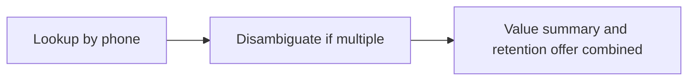

---

**What if the response includes multiple plans, accounts, or memberships?**

If a customer can have more than one plan, account, or membership, we need a clear way to **isolate the current active one** so we know which ID to use for cancellation and retention offers.

We have 2 options:

- **Option A:** Return a single **active** plan/membership in the payload (e.g. the one that is current for this customer or this vehicle), and/or  
- **Option B:** If you return a list (e.g. `plans: [...]` or `memberships: [...]`), include a field we can use to identify the active one, for example:
  - `status: "active"` (or equivalent) on the relevant item, or  
  - A top-level field such as `active_plan_id`, `current_membership_id`, or `primary_account_id` that points to the one we should use for cancel and retention.

We need at least one **stable identifier for the active plan/membership** (whatever you call it) so we can pass it to get retention offer and to cancel. If the customer has multiple and we need to let them choose, we can support that in the voice flow (e.g. “You have Plan A and Plan B; which one do you want to cancel?”), but we need to know how to tell which is which in the payload (e.g. by `plan_id` + `plan_name` or similar). Our default first lookup is by phone; if that returns multiple plans or vehicles, we use email or license plate to verify and narrow until we have a single plan to cancel, then we call the combined value-summary and retention-offer endpoint once. Lookup by phone or email may surface multiple plans or vehicles; lookup by license plate is usually scoped to one vehicle and its active plan, which simplifies cancellation when the customer is cancelling "for this car."

---

**Lookup by phone/email vs. by license plate**

- **Lookup by phone** and **lookup by email** may return **multiple results** (e.g. multiple plans, multiple vehicles, or a combination), because one person can have several accounts, plans, or vehicles. We need to handle that explicitly: either you return a single active/default when you can determine it, or a clear list with stable IDs (and optionally `plan_name` or vehicle info) so we can disambiguate in the voice flow (e.g. "You have Plan A on the Camry and Plan B on the Accord—which do you want to cancel?") and then use only the chosen IDs for get-info, value-summary, cancel, and retention.
- **Lookup by license plate** (and state) is scoped to **one vehicle**, so the response can naturally be that vehicle and its **active plan** (or the IDs we need for that car). That reduces ambiguity and avoids asking the customer for extra information when they are cancelling for that car. We want to request only what is necessary; when the caller identifies by plate, we can assume the response is for that vehicle's active plan unless you document otherwise.

---

## Overview: How the Voice AI Uses Your API

The integration flow is: lookup by phone returns customer + plan + vehicle; we disambiguate if needed (email, license plate, or clarifying questions, e.g. "Which plan do you want to cancel?"), then make **one combined** value-summary + retention-offer call; after that we play back, present offer, and apply-offer or cancel. The default first lookup is always by phone (incoming call’s ANI).

**Call start and greeting (high level):**

"Get customer + plan + vehicle" is the first lookup response; value and offer come in a later combined call.

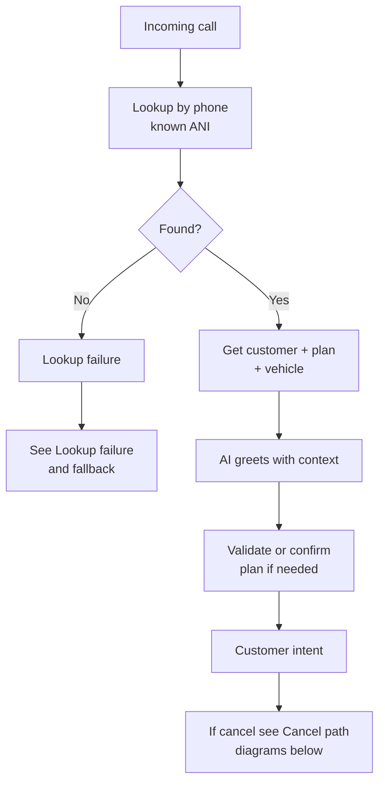

**After greeting: cancel intent and outcomes**

When the customer’s intent is cancel, the flow continues as below. See the Operational Flows section for sequence diagrams.

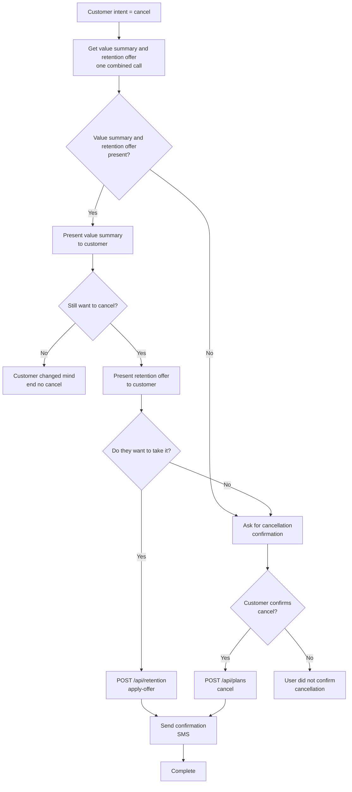

**Lookup failure and fallback**

Used when the system does not have a matching customer for the incoming phone number, or when we need to disambiguate (e.g. multiple results from phone lookup). Try email, then plate, then ask for an alternative identifier. When multiple results from phone lookup, use email or plate to narrow; once the plan is isolated, call the combined value-summary and retention-offer endpoint.

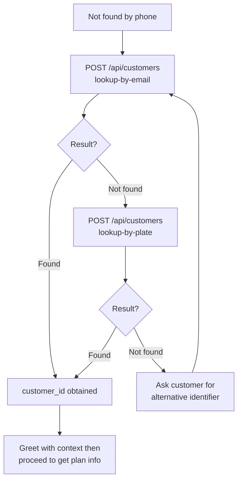

---

## Value summary and retention flow

Before presenting a **retention offer**, we play back a **value summary** to the customer so they can see what they’re getting from their plan. We only use value summary and retention offer data **after** the customer has been identified (at call start via lookup) and has stated cancel intent (after the AI has asked "How can I help?" and the customer says they want to cancel). If we already greeted by name from lookup, we may still confirm account or plan when needed (e.g. multiple plans).

**How value summary and retention offer can be provided:** **(a)** Separate: value-summary API and retention-offer API (single responsibility). **(b)** Combined: one endpoint (e.g. get_value_summary_and_retention_offer or retention offer that includes value summary). Flow: present value summary first → ask if still want to cancel → if yes, present retention offer → accept (apply-offer) or no (confirm cancel). When both are null, go straight to cancellation confirmation. See Overview flowchart (After greeting: cancel intent and outcomes).

**Context:** Plans have tiers (e.g. unlimited, N washes per period). Jax knows membership prices, wash history, and single-use wash prices. From that we can communicate: what the customer pays, how often they wash (e.g. X times per month), what each wash would cost without the plan, and the **value saved** (e.g. “You pay $25/month for unlimited; you’ve used 4 washes this month; at $15 each that’s $60 value—you’ve saved $35”). The voice AI will phrase this in natural language from a **structured JSON payload**; exact wording is not fixed in the API.

**Flow:**

- After the plan is isolated, we call the **combined** value-summary + retention-offer endpoint once. We play back value summary and present the offer from that single response. Then apply-offer or confirm cancel as needed.

**Common sequence:** (1) Customer identified and plan confirmed. (2) Customer states cancel intent. (3) We have value summary and retention offer data (from one combined call or separate calls). If both are null → cancellation confirmation, then cancel. (4) Present value summary when not null. (5) If customer still wants to cancel, present retention offer. (6) Accept → apply-offer; decline → confirm cancel, then cancel. See Overview flowchart (After greeting: cancel intent and outcomes).

**When to return null:** If the customer has no value gained, or value gained is less than what they paid, you may return **value summary null** and/or **retention offer null**. We will not play value summary or present an offer in that case; we proceed to cancellation confirmation as needed.

---

## Endpoint Priority

| Priority | Purpose | Endpoints |
|----------|---------|-----------|
| **Priority (support first)** | Identify customer, get plan/membership info, value summary for playback, trigger cancellation, and retention offer exchange | Look up by phone, email, or license plate; get plan info; get value summary (wash history/savings); cancel plan; get retention offer; apply retention offer |
| **Lower priority (useful later)** | Deeper data and lifecycle operations | Get vehicle/data by identifier, create plan/membership (if needed) |

*Value summary and retention offer may be: separate endpoints (single responsibility) or one combined endpoint.*

---

## Base Configuration

**Base URL:** `https://api.jaxkarwash.example.com` (or your chosen host)

**Authentication:** You can choose your own authentication mechanism (e.g. API key, Bearer token, or OAuth2). The following is for illustration only; use whatever fits your setup.

- **Header:** `Api-Key` (or `Authorization: Bearer <token>` for Bearer, or OAuth2 access token in `Authorization` if you use OAuth2).
- **Content-Type:** `application/json` for all POST requests.

*This integration is single-tenant; tenant-scoping headers (e.g. `X-Tenant-Id`) are not required.*

---

## Priority Endpoints (Support First)

The endpoints below are what we expect to need for the core voice AI flows: identify the customer, understand their plan/membership, play back value summary when cancelling, perform cancellation, and handle retention offers. The endpoint paths and names below (e.g. `POST /api/retention/get-offer`, `POST /api/plans/value-summary`) are **examples** and can be combined or renamed to match how you group data (e.g. value summary + retention combined) as described in the Integration approach and Endpoint grouping options above.

---

### 1. Lookup Customer by Phone

**Priority:** Yes

**Purpose:** Identify the customer by phone number. Used at call start and when the caller is identified by phone. At call start, the system uses the incoming call’s phone number (ANI) to call this endpoint before playing any greeting so the AI can greet the customer by name and with context.

**Endpoint:** `POST /api/customers/lookup-by-phone`

**Request Body:**

```json
{
  "phone": "5551234567"
}
```

*Phone can be normalized (e.g. 10 digits, no +1); document your expected format.*

**Response (200 – found):**

```json
{
  "customer_id": "12345",
  "name": "John Doe",
  "email": "john.doe@example.com",
  "phone_number": "5551234567",
  "status": "active"
}
```

*Return whatever stable identifier you use for the customer (`customer_id`, `member_id`, `account_id`, etc.). We use it in later calls.*

*Depending on your data, this may return multiple plans or vehicles for one phone number. If so, either return a single active/default or a list with clear identifiers so we can disambiguate with the customer and use only the chosen plan/vehicle for subsequent calls.*

**Response (404 – not found):**

```json
{
  "error": "Customer not found",
  "message": "No customer found for this phone number"
}
```

---

### 2. Lookup Customer by Email

**Priority:** Yes

**Purpose:** Identify the customer by email when they use email instead of phone.

**Endpoint:** `POST /api/customers/lookup-by-email`

**Request Body:**

```json
{
  "email": "john.doe@example.com"
}
```

**Response (200 – found):** Same shape as lookup-by-phone (include your customer/member/account identifier and name, email, etc.). As with phone, the response may include multiple plans or vehicles; we need either a single active/default or a clear list for disambiguation.

**Response (404 – not found):** Same pattern as lookup-by-phone.

---

### 3. Lookup Customer by License Plate

**Priority:** Yes

**Purpose:** Identify the customer when they provide license plate (and state) instead of phone or email.

**Endpoint:** `POST /api/customers/lookup-by-plate`

**Request Body:**

```json
{
  "license_plate": "ABC123",
  "state": "CA"
}
```

**Response (200 – found):**

```json
{
  "customer_id": "12345",
  "name": "John Doe",
  "vehicle_id": "v789",
  "license_plate": "ABC123",
  "state": "CA"
}
```

*If your hierarchy uses something other than `customer_id` or `vehicle_id`, use your IDs; we will pass them back in subsequent requests.*

*Because the request is keyed by vehicle (plate + state), the response is typically one vehicle and its active plan (or the IDs needed for that vehicle). That scoping lets us proceed without asking for more information when the customer is cancelling for that car.*

**Response (404 – not found):** Same pattern as above.

---

### 4. Get Plan / Membership / Subscription Info

**Priority:** Yes

**Purpose:** Retrieve the customer’s current plan, membership, or subscription so we can confirm what they have and obtain any ID needed for cancellation or retention. We use “plan/membership/subscription” generically; map to your entity (e.g. subscription, membership, plan).

**Endpoint:** `POST /api/plans/get-info`  
*(Or `/api/membership/get-info`, `/api/subscription/get-info`, etc. – path is flexible.)*

**Request Body:**

```json
{
  "customer_id": "12345"
}
```

*If you key by something else (e.g. `member_id`, `account_id`), use that field name; we will send back the identifier you returned from lookup.*

**Response (200 – has active plan):**

```json
{
  "plan_id": "sub456",
  "customer_id": "12345",
  "status": "active",
  "plan_name": "Unlimited Monthly",
  "start_date": "2025-01-15",
  "next_billing_date": "2026-03-15",
  "auto_renew": true
}
```

*Use your real field names. We need at least one stable ID for the plan/membership/subscription (e.g. `plan_id`, `subscription_id`, `membership_id`) to use in cancel and optionally in retention.*

**Response (200 – no active plan):**

```json
{
  "plan_id": null,
  "customer_id": "12345",
  "status": "none",
  "message": "No active plan or membership found"
}
```

---

### 5. Get value summary (wash history / savings)

**Priority:** Yes (for cancellation flow)

**Purpose:** Return structured data so the voice AI can play back to the customer how much value they get from their plan before we present a retention offer. Plans have tiers and wash allowances (e.g. unlimited, or N washes per day/week/month). Jax knows membership prices, wash history, and single-use wash prices. We need either the raw numbers (plan price, washes used, single-use price per wash) or pre-calculated value saved. The voice AI will phrase the message from this payload; exact wording is not fixed by the API. This may be a separate endpoint or combined with retention offer in one call; when combined, one response is used for playback and for the offer.

**Endpoint:** `POST /api/plans/value-summary`  
*(Or `/api/membership/value-summary`, `/api/usage/summary`, etc. – path is flexible. This data can also be included in get-info or in the single customer-information payload; if so, a separate call is not needed. You may also combine value summary and retention offer in one endpoint that returns both.)*

**Request Body:**

```json
{
  "customer_id": "12345",
  "plan_id": "sub456"
}
```

*Use the same IDs returned from lookup and get-info.*

**Response (200):**

```json
{
  "customer_id": "12345",
  "plan_id": "sub456",
  "plan_name": "Unlimited Monthly",
  "plan_tier": "unlimited",
  "plan_price": 25.00,
  "plan_price_currency": "USD",
  "period_type": "month",
  "period_start": "2026-02-01",
  "period_end": "2026-02-28",
  "washes_used_in_period": 4,
  "single_use_price_per_wash": 15.00,
  "value_of_washes_at_single_use": 60.00,
  "value_saved_in_period": 35.00
}
```

*Field names can follow your model. We need at least: what the customer pays for the plan, how many washes they used in the period, what a single wash costs without the plan, and either value_saved or the components so we can communicate “you saved $X” or equivalent. If you prefer to return only components (e.g. plan_price, washes_used_in_period, single_use_price_per_wash), we can compute value_saved on our side.*

**Response (200 – no value to show):** If the customer has no value gained or value gained is less than amount paid, you may return value summary null (or an empty/equivalent structure). We will not play value summary and will proceed to cancellation confirmation or to presenting the retention offer (if returned in the same response).

**Response (404 – e.g. no plan or no usage data):** Standard error body; we will skip value playback and proceed to cancellation confirmation or to presenting the retention offer (if returned in the same response).

---

### 6. Cancel Plan / Apply Cancellation

**Priority:** Yes

**Purpose:** Cancel the customer’s plan, membership, or subscription. Naming on your side can be “cancel plan”, “apply cancellation”, “cancel subscription”, etc.; the intention is to cancel.

**Endpoint:** `POST /api/plans/cancel`  
*(Or `/api/subscription/cancel`, `/api/cancellation/apply`, etc.)*

**Request Body:**

```json
{
  "customer_id": "12345",
  "plan_id": "sub456",
  "cancel_at_period_end": true,
  "cancellation_reason": "Customer requested"
}
```

*`plan_id` is the ID you returned from “get plan/membership info”. If you use `subscription_id` or `membership_id`, use that name.*

**Response (200 – success):**

```json
{
  "success": true,
  "message": "Plan cancelled successfully",
  "plan_id": "sub456",
  "cancellation_date": "2026-02-20",
  "effective_date": "2026-03-15",
  "cancel_at_period_end": true
}
```

**Response (400 – e.g. already cancelled):**

```json
{
  "success": false,
  "error": "Invalid request",
  "message": "Plan is already cancelled"
}
```

---

### 7. Get Retention Offer

**Priority:** Yes

**Purpose:** Check whether the customer has a retention offer. The response should include a **retention_offer_id** (or equivalent) for use in apply. How you link the offer to your data (plan, account, membership, etc.) is up to your model; we only need a stable offer ID to pass to apply. This may be a separate endpoint or combined with value summary in one call. This endpoint **may be combined with value summary** in one response; when combined, we use that single response for both playback and for presenting the offer. If there is no value to show or no offer to give (e.g. no value gained or value gained is less than amount paid), returning retention_offer_id null and/or value summary null is fine—we skip playback and/or offer and proceed to confirm cancel as needed.

**Endpoint:** `POST /api/retention/get-offer`

**Request Body:**

```json
{
  "customer_id": "12345",
  "plan_id": "sub456"
}
```

*Include whatever IDs you need to look up the offer (e.g. customer + plan, or account + membership).*

**Response (200 – offer available):**

```json
{
  "retention_offer_id": "offer789",
  "customer_id": "12345",
  "description": "50% off next wash",
  "discount_percent": 50,
  "expires_at": "2026-03-01T00:00:00Z",
  "terms": "Valid for one-time use"
}
```

*`retention_offer_id` must be unique and usable in the apply endpoint. You can also include IDs that tie to your hierarchy (e.g. plan_id, account_id) if needed.*

**Response (200 – no offer):**

```json
{
  "retention_offer_id": null,
  "customer_id": "12345",
  "message": "No retention offers available"
}
```

---

### 8. Apply Retention Offer

**Priority:** Yes

**Purpose:** Apply or redeem a retention offer. Uses the **retention_offer_id** from get-offer or from the combined value-summary+retention-offer response, and a customer/member/account identifier so the offer is applied in line with your data model.

**Endpoint:** `POST /api/retention/apply-offer`

**Request Body:**

```json
{
  "retention_offer_id": "offer789",
  "customer_id": "12345"
}
```

*If you need additional IDs (e.g. plan_id, account_id, membership_id) to apply the offer, add those fields; we can pass back any IDs you returned in get-offer or get-info.*

**Response (200 – success):**

```json
{
  "success": true,
  "message": "Offer applied successfully",
  "retention_offer_id": "offer789",
  "customer_id": "12345",
  "applied_at": "2026-02-20T14:30:00Z",
  "discount_code": "WASH50-789"
}
```

**Response (400/404 – e.g. expired or invalid):**

```json
{
  "success": false,
  "error": "Offer expired",
  "message": "This offer expired on 2026-03-01"
}
```

---

## Lower Priority Endpoints (Useful Later)

These support richer flows and lifecycle operations. We do not assume your hierarchy (e.g. account vs member vs vehicle); design paths and request fields to match your model.

---

### 9. Get Vehicle / Related Data by Identifier

**Priority:** Lower

**Purpose:** Get vehicle (or related) data when the voice AI flow needs it. We do not assume whether data is keyed by account, member, vehicle, or something else; the endpoint should accept whatever identifier fits your hierarchy.

**Endpoint:** `POST /api/data/get-by-identifier`  
*(Or `/api/vehicles/get-by-account`, `/api/members/get-vehicles`, etc. – name and path to match your model.)*

**Request Body (example – by account/customer):**

```json
{
  "customer_id": "12345"
}
```

*Alternatively you might use `account_id`, `member_id`, `vehicle_id`, or a combination; document what you need.*

**Response (200):**

```json
{
  "data": [
    {
      "vehicle_id": "v789",
      "license_plate": "ABC123",
      "state": "CA",
      "make": "Toyota",
      "model": "Camry",
      "plan_id": "sub456",
      "plan_status": "active"
    }
  ]
}
```

*Structure can follow your hierarchy (e.g. vehicles with nested or linked plan/membership). We need enough to support cancellation or retention if this path is used in those flows.*

**Response (200 – empty):**

```json
{
  "data": []
}
```

---

### 10. Get Plan / Membership / Subscription (by alternative key)

**Priority:** Lower

**Purpose:** Same as Priority endpoint 4, but keyed by something other than customer (e.g. vehicle_id, account_id, membership_id) if your model works that way.

**Endpoint:** `POST /api/plans/get-info-by-key`  
*(Path and name can vary.)*

**Request Body (example):**

```json
{
  "vehicle_id": "v789"
}
```

*Or `account_id`, `membership_id`, etc., depending on your hierarchy.*

**Response:** Same idea as Priority endpoint 4: return plan/membership/subscription info and the ID(s) needed for cancel and retention.

---

### 11. Create Plan / Membership / Subscription

**Priority:** Lower

**Purpose:** Create or enroll in a plan/membership/subscription when your business process supports it via API. Not required for the initial cancellation and retention flows.

**Endpoint:** `POST /api/plans/create`  
*(Or equivalent path for membership/subscription creation.)*

**Request Body:** To be defined based on your required fields (e.g. customer_id, plan type, vehicle_id, start date).

**Response:** Return the created resource and its IDs so they can be used in get-info and cancel if needed.

---

## Operational Flows (Priority)

**Note:** The flows below illustrate the general approach with validation, confirmation, and error handling. Specific prompts, confirmation wording, and error recovery strategies will be refined through discussion with tech teams and Meddy.

### Flow 1: Cancel by Phone

**Diagram 1a – Call start (phone):** Incoming call; system looks up by known phone, then greets with context. If not found, see Lookup failure and fallback (Overview section). Lookup returns customer + plan + vehicle; value summary and retention offer are fetched later (combined or separate).

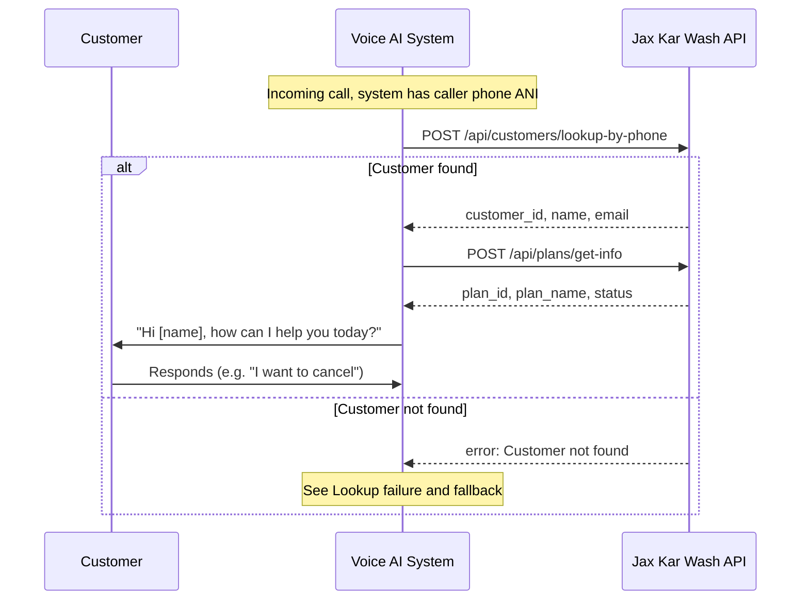

**Diagram 1b – Cancel by phone (after greeting):** Customer said they want to cancel; confirm plan if needed, then get value summary and retention offer (one combined call or separate value-summary and get-offer calls). Outcomes are in Diagram 1c.

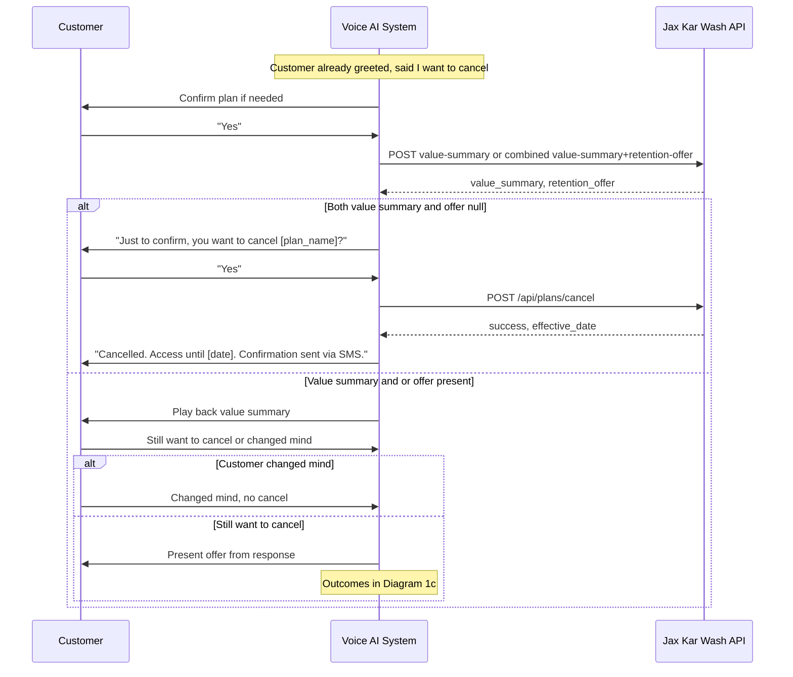

After plan is isolated, we call the combined value-summary+retention-offer endpoint (or separate endpoints) once.

**Diagram 1c – Cancel outcomes:** After we have value summary and offer data (or when no value/offer), one of three outcomes.

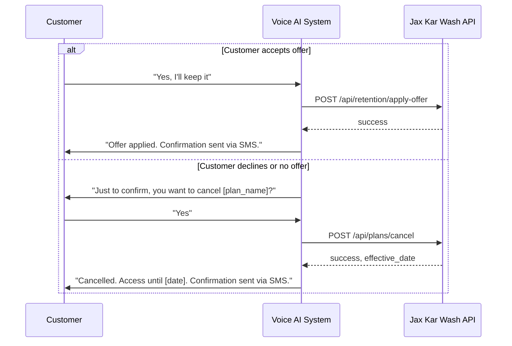

### Flow 2: Cancel by License Plate

When identification is by plate (e.g. after lookup failure and customer provides plate, or customer says "cancel for plate ABC123, CA"). After this diagram, the cancel path and outcomes are the same as Flow 1 (Diagram 1b and 1c).

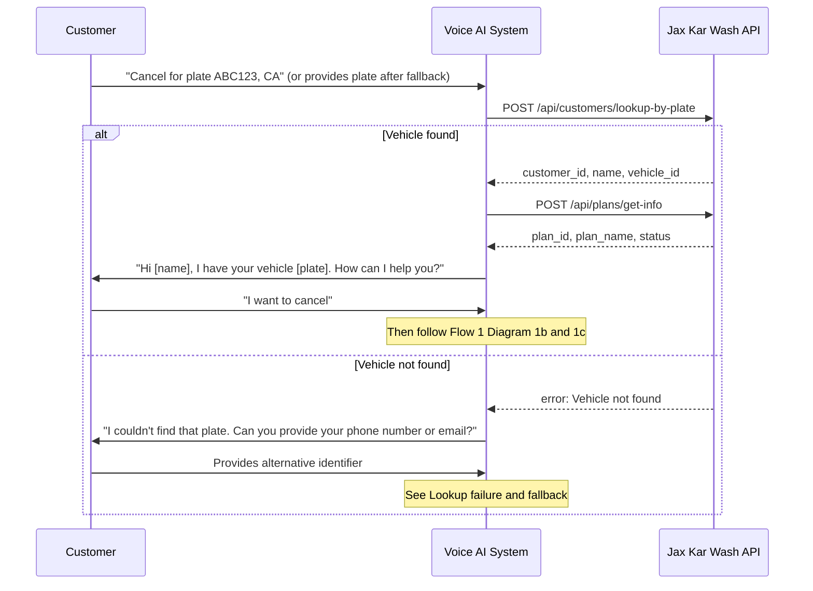

---

### Flow 3: Retention Offer – Get and Apply

Customer already identified and greeted; AI has context. Same flow whether the customer asks for offers at the start or during the conversation.

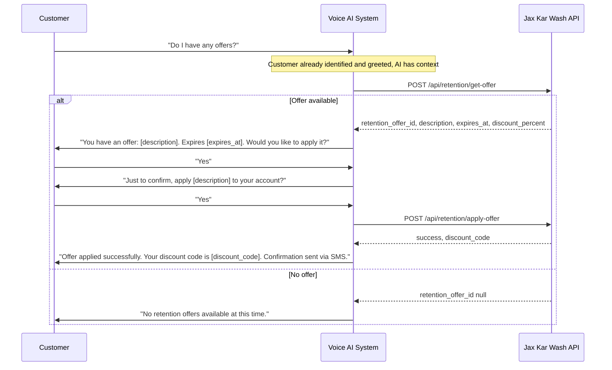

---

### Flow 4: When Lookup by Phone Fails – Identify by Email

Used when lookup by phone returns not found; customer provides email (e.g. after generic greeting and "Can you give me your email?"). After this diagram, use the same cancel path and outcomes as Flow 1 (Diagram 1b and 1c).

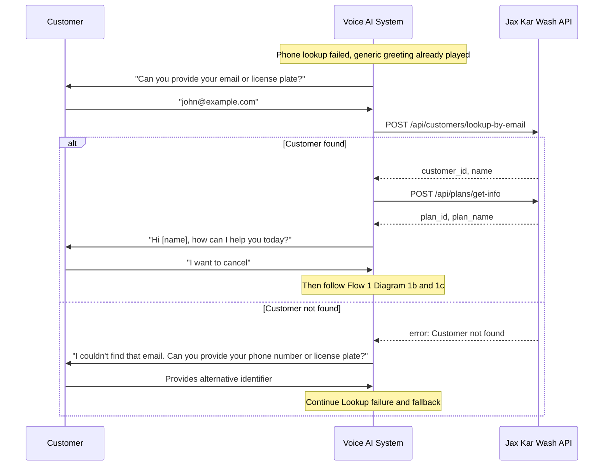

---

### Flow 5 and 6: Full Cancellation (Detailed)

For a detailed step-by-step sequence of cancellation by phone, see **Flow 1** (Diagrams 1a, 1b, 1c). For cancellation when the customer is identified by license plate, see **Flow 2** and then Flow 1 Diagrams 1b and 1c.

---

### API Call Decision Tree

Which API endpoints the system calls depends on call start (lookup by known phone first), then customer intent. All calls are POST. This diagram shows the decision points including lookup failure fallback, validation, confirmation, and error handling. Value summary and retention offer come from one combined call (or separate calls) after plan is isolated.

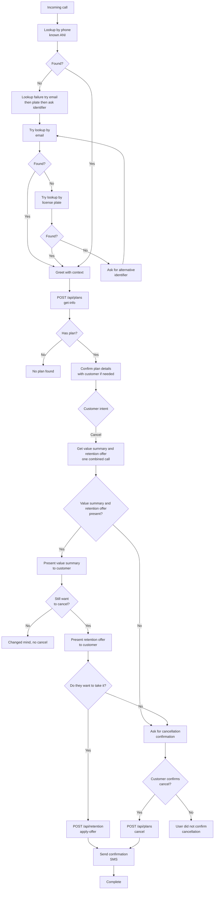

---

### ID Flow Between Endpoints

IDs returned from one endpoint are passed into the next. This diagram shows the minimal set for the **multi-call approach**. Value summary and retention offer are one combined endpoint (or separate value-summary and get-offer); we call after plan is isolated.

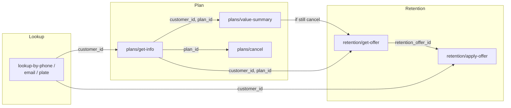

If value summary and retention offer are combined, one call replaces the separate value-summary and get-offer steps.

---

## Error Handling

**Standard error body:**

```json
{
  "error": "Error type",
  "message": "Human-readable message"
}
```

**HTTP status codes:**

- `200` – Success (including “no offer” or “no plan”)
- `400` – Invalid input or business rule (e.g. already cancelled)
- `401` – Invalid or missing API key
- `404` – Resource not found (customer, plan, offer, or value-summary e.g. no usage data)
- `500` – Server error

Always return JSON. For cancel and apply-offer, include `success: true` or `success: false` in the body where applicable.

---

## Request/Response Summary

Lookup by phone (default) returns customer + plan + vehicle; disambiguation if needed; then one combined value-summary+retention-offer call (or separate calls). Then apply-offer or cancel.

### Request/Response flow

Lookup by phone (default) returns customer + plan + vehicle. If multiple results, disambiguate (email, license plate, or clarifying questions). Then one **combined** value-summary + retention-offer call (or use separate value-summary and get-retention-offer endpoints if preferred). Then apply-offer or cancel.

| Step | Operation | Endpoint (examples; paths flexible) | Request (example) | Response (example) |
|------|-----------|-----------------------------------|-------------------|---------------------|
| 1 | Lookup by phone | `POST /api/customers/lookup-by-phone` or `/api/members/lookup-by-phone`, `/api/accounts/lookup-by-phone` | `{"phone": "5551234567"}` | `{"customer_id": "12345", "name": "John Doe", "email": "...", "phone_number": "..."}` — may include plans/vehicles or list for disambiguation |
| 1 | Lookup by email or plate (disambiguation) | `POST /api/customers/lookup-by-email` or `lookup-by-plate`; or `/api/members/lookup-by-email`, `/api/vehicles/lookup-by-plate` | `{"email": "..."}` or `{"license_plate": "ABC123", "state": "CA"}` | Same shape as phone; plate often returns `vehicle_id`, one vehicle + active plan |
| 2 | Get value summary + retention offer (combined or separate) | `POST /api/plans/value-summary` or combined e.g. `/api/plans/value-and-offer`, `/api/retention/get-value-and-offer`; or `/api/membership/value-summary`, `/api/usage/summary` | `{"customer_id": "12345", "plan_id": "sub456"}` | Value: `plan_price`, `washes_used_in_period`, `value_saved_in_period`, etc. Offer: `retention_offer_id`, `description`, `expires_at` (or nested in same payload) |
| 3 | Apply retention offer | `POST /api/retention/apply-offer` or `/api/offers/apply`, `/api/retention/redeem` | `{"retention_offer_id": "offer789", "customer_id": "12345"}` | `{"success": true, "message": "...", "retention_offer_id": "...", "discount_code": "..."}` |
| 3 | Cancel plan | `POST /api/plans/cancel` or `/api/subscription/cancel`, `/api/cancellation/apply` | `{"customer_id": "12345", "plan_id": "sub456", "cancel_at_period_end": true, "cancellation_reason": "Customer requested"}` | `{"success": true, "message": "...", "plan_id": "...", "effective_date": "..."}` |
| — | Get plan info (if not in lookup) | `POST /api/plans/get-info` or `/api/membership/get-info`, `/api/subscription/get-info` | `{"customer_id": "12345"}` | `{"plan_id": "sub456", "customer_id": "12345", "status": "active", "plan_name": "Unlimited Monthly"}` |
| — | Get data by identifier | `POST /api/data/get-by-identifier` or `/api/vehicles/get-by-account`, `/api/members/get-vehicles` | Your identifier(s), e.g. `{"customer_id": "12345"}` | Your structure |
| — | Get plan by key | `POST /api/plans/get-info-by-key` or `/api/plans/get-by-key` | e.g. `{"vehicle_id": "v789"}` or `{"account_id": "..."}` | Same shape as get-info |
| — | Create plan | `POST /api/plans/create` or `/api/subscription/create`, `/api/membership/create` | Per your requirements | Created resource + IDs |

---

## Testing Recommendations

1. **Priority endpoints first:** Look up by phone, email, or license plate; get plan info; get value summary (for cancellation flow); cancel; get retention offer; apply retention offer.
2. **Multiple results:** Test phone and email lookup when the customer has multiple plans or vehicles (disambiguation or single active); test plate lookup for a single vehicle and its active plan.
3. **Error cases:** Not found, invalid IDs, already cancelled, expired offer, invalid phone/email/plate format.
4. **ID consistency:** Same identifier from lookup (and get-info when used) is used for value-summary, cancel, and retention; retention_offer_id from get-offer is used in apply-offer.
5. **Hierarchy:** If you use account/member/vehicle distinctions, test with the IDs and field names that match your model.
6. If Jax supports both separate and combined value-summary/retention-offer options, test both.

---

## Next Steps

This document outlines the general plan for API integration. The specific workflows, confirmation prompts, error handling strategies, and edge cases will be refined through ongoing discussions with the tech teams and Meddy. Endpoint paths, request/response formats, and field names can be adjusted to align with Jax's existing API structure and conventions.

---

## Future discussion: all-in-one option

We have documented the flow above (lookup by phone for customer, plan, and vehicle; then one combined value-summary and retention-offer call). As a possible future optimization or follow-up discussion, we could also explore **combining all of these operations into a single API call** (e.g. one lookup by phone returning customer, plan, vehicle, value summary, and retention offer together). That would reduce round-trips and simplify the flow further; we can revisit this once the current integration is in place.

---

For questions about integration, endpoint naming, or mapping to your data model, reach out to the tech teams or Meddy to continue the discussion.
